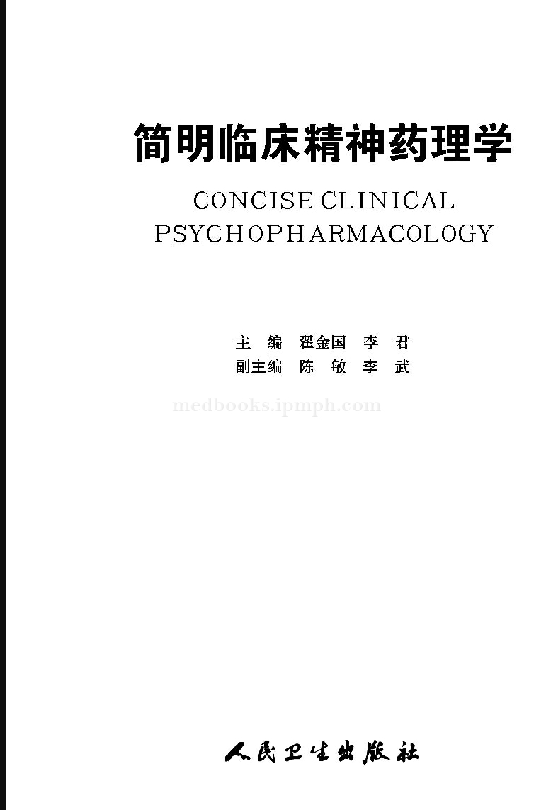
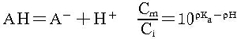
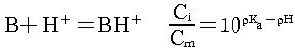

# 内封

# 版权页
图书在版编目（CIP）数据

简明临床精神药理学／翟金国，李君主编．—北京：人民卫生出版社，2013

ISBN 978‐7‐117‐18101‐3

Ⅰ﹒①简… Ⅱ﹒①翟…②李… Ⅲ﹒①精神药理学Ⅳ﹒①R964

中国版本图书馆CIP数据核字（2013）第245556号

人卫社官网 www﹒p mph﹒com 出版物查询，在线购书

人卫医学网 www﹒ip mph﹒com 医学考试辅导，医学数据库服务，医学教育资源，大众健康资讯

版权所有，侵权必究！

简明临床精神药理学

主 编：翟金国 李 君

出版发行：人民卫生出版社（中继线010‐59780011）

地 址：北京市朝阳区潘家园南里19号

邮 编：100021

E‐mail：pmph＠pmph.com

购书热线：010‐59787592 010‐59787584 010‐65264830

印 刷：

经 销：新华书店

开 本：850×1168 1／32 印张：18.5 插页：4

字 数：480千字

版 次：2013年 月第1版2013年 月第1版第1次印刷

标准书号：ISBN 978‐7‐117‐18101‐3／R·18102

定 价：元

打击盗版举报电话：010‐59787491 E‐mail：WQ ＠p mph﹒com

（凡属印装质量问题请与本社市场营销中心联系退换）
# 作者页
编 委（按姓氏笔画排序）

王 彬（济宁医学院附属第二医院）

王建军（济宁市精神病防治院）

叶 萌（华中科技大学同济医学院

附属精神卫生中心）

寻广磊（山东省精神卫生中心）

苏中华（济宁医学院附属第二医院）

李 飞（中南大学湘雅医院）

李 君（北京师范大学认知

神经科学与学习研究院）

李 武（山东省安康医院）

李丽君（首都医科大学附属北京安定医院）

宋学勤（郑州大学第一附属医院）

张玉虎（广东省人民医院）

张传芝（济宁市精神病防治院）

张跃兵（济宁医学院附属第二医院）

陈 敏（济宁医学院）

国效峰（中南大学湘雅二医院）

房茂胜（华中科技大学同济医学院

附属精神卫生中心）

高 燕（济宁医学院）

谢传革（山东省安康医院）

翟金国（济宁医学院）

魏钦令（中山大学附属第三医院）

学术秘书：陈 敏（兼）
# 本书受以下项目经费资助
1﹒卫生部卫生公益性行业科研专项经费项目（201002003）

2﹒山东省自然科学基金项目（ZR2012HM065）

3﹒山东省医药卫生科技发展计划项目（2007HW037，2009HZ012，2009QZ003）
# 主编简介

翟金国，男，出生于1966年10月，山东鱼台人，济宁医学院精神卫生学院教授，主任医师，医学硕士，硕士生导师，精神药理学教研室主任，兼任济宁医学院附属第二医院精神科主任。从事精神科临床、科研和教学工作24年。

作为主要研究人员，参加了国家“十五”攻关课题、卫生部卫生公益性行业科研专项课题、国家自然科学基金项目等多项科研课题。主持山东省自然科学基金项目、山东省软科学项目、山东省教育厅课题、山东省卫生厅课题、济宁市科技局课题等多项省部级课题，参加新加坡国立大学、中南大学、北京师范大学等国际、国内横向课题，获山东省和济宁市科研、教学成果奖多项。发表科研论文60余篇，SCI收录10篇。主编专著5部，副主编卫生部“十一五”规划教材1部。主编全英文教材Clinical Psy chiatry，在精神医学专业本科生中使用。参与编写了《精神分裂症综合康复技术使用手册》，作为主讲人录制了《精神分裂症综合康复技术》视听光盘，出版后收到良好效果。在健康报、健康时报、环球时报、家庭医生报等报刊发表科普文章100多篇。为数家报刊特约撰稿人。承担精神药理学、精神病学基础、临床精神病学的双语教学任务。兼任国家自然科学基金、山东省自然科学基金项目评审专家、《中华行为医学与脑科学杂志》、《中华脑科疾病与康复杂志》特约审稿专家、山东省医学会精神病学分会委员、山东省医师协会精神科医师分会委员，被济宁市委命名为“圣地名师”。

李君，女，出生于1978年11月，山东东营人，北京师范大学认知神经科学与学习研究院、认知神经科学与学习国家重点实验室副研究员，副教授，医学博士，博士生导师。2000年毕业于济宁医学院精神病与精神卫生学专业，同年考入北京大学，攻读硕士和博士学位，师从儿童精神病学专家王玉凤教授和周儒伦教授（NI H），从事精神疾病的分子遗传学研究，重点对ADHD核心家系进行5‐HT系统基因多态性研究。2005—2007年在中国科学院自动化研究所进行博士后研究，在站期间的主要研究方向：神经与精神疾病的影像基因组学，重点进行了I Q的影像基因组学研究。目前承担有国家自然科学基金课题等多个研究项目，有丰富的精神病学、分子遗传学、认知神经科学和脑影像学等教育和研究经历，研究兴趣主要立足于分子遗传学，借助于对精神疾病患者临床症状和认知功能的评定及认知任务下脑磁共振成像特点的研究，探讨精神疾病的分子遗传学基础。2013年被公派美国进行相关研究。在上述领域已经发表大量论文，其中SCI论文40余篇。多次获得相关科技奖和优秀论文奖。
# 前言
目前，药物治疗仍是精神障碍治疗的主要手段。无论是患者及其家人，还是精神科医生，对精神药理学知识都有巨大的需求。但是，国内关于精神药理学方面的专著较少，比较有影响的是上海江开达教授主编的《精神药理学》和北京司天梅等教授翻译的《Stahl精神药理学精要》，这两本专著属于高级读物，专业性强，内容很细、很深，读者群较窄，适合精神科中高级专业技术人员阅读，不适合低年资青年医生、非精神科临床医生和患者、家属阅读。另外，精神药理学发展日新月异，近几年有大量新信息出现，需要把这些新知识、新信息及时传达给大家。

本书从精神药理学基础、临床精神药理学、精神障碍的药物治疗学三方面简明扼要地介绍精神药理学基础知识、临床常用和最新精神药物、作用机制和临床应用、精神障碍最新的药物治疗方法和策略等信息，使读者能够了解精神药理学与精神障碍治疗学的基本理论与临床实际应用的知识和进展，使他们了解各类精神障碍的实用治疗方法，为精神科医生、护理人员、临床各科医生、精神障碍患者和家属提供一本简明、实用的工具书。

本书的主要编写者多为从事该领域研究的硕士、博士，或具有多年临床科研经验的副教授、教授等，在一定程度上保证了本书内容的新颖性。同时，结合自身的临床工作经验进行阐述，增加了本书的实用性。

在本书撰写过程中，各位作者参考了大量文献，由于篇幅所限，并未全部列出，在此对所有文献的作者表示衷心感谢。由于学科发展迅速，变化日新月异，编写人员知识所限，时间仓促，书中不当之处在所难免，敬请批评指正。书中涉及的所有药物均应在专业医生指导下使用。

感谢所有作者的辛勤劳动和人民卫生出版社的支持。

感谢卫生部2010年度卫生公益性行业科研专项经费项目（201002003）、山东省自然科学基金项目（ZR2012H M065）和山东省医药卫生科技发展计划项目（2007H W037，2009HZ012，2009QZ003）的资助。

翟金国

2013年10月

# 第一篇 精神药理学基础
## 第一章 精神药理学概述
### 第一节 关于精神药理学
精神药理学（psychophar macology）是药理学的一个新的重要分支学科，是研究药物与机体，特别是与中枢神经系统相互作用的科学。

药理学研究的内容主要包括药效动力学（药效学，phar ma codynamics）和药物代谢动力学（药动学，phar macokinetics）。精神药理学研究的内容主要包括精神药物效应动力学（精神药效学，psycho‐phar macodynamics）和精神药物代谢动力学（精神药动学，psycho‐phar macokinetics）。精神药效学研究精神药物对机体的作用及作用机制，即药物如何发挥治疗作用，毒副作用是如何产生的；精神药动学研究药物在体内的吸收、分布、代谢和排泄及其变化规律，即机体对精神药物的处置过程。

精神药理学的主要任务是探讨精神药物的作用机制和规律，以指导临床合理用药，并对精神疾病进行有效的防治。其次是通过药物作用机制的研究，探讨精神障碍可能的病理机制，为新药研发和精神障碍病因学研究提供依据。

1952年第一个抗精神病药氯丙嗪（chlorpromazine）问世，用于精神障碍的治疗并取得显著疗效，开创了精神障碍药物治疗的纪元。随后，众多新的精神药物不断问世，为精神障碍患者带来了福音。大量临床实践证明，精神药物不但能够有效缓解精神症状，同时能够防止疾病复发，改善患者的社会功能，提高患者及其家人的生活质量，降低精神障碍的疾病负担。药物治疗成为治疗精神障碍，特别是重性精神障碍的最主要、最有效的手段。有关精神药物的作用机制、治疗作用及相关的临床理论与实践的学说不断地发展和丰富，从而形成了一门新的分支学科——精神药理学。精神药理学的理论原则主要为神经科学理论和药物药理学理论的有机结合。在神经科学方面，研究领域涉及药物对神经递质、受体、神经激素、神经信号传递及第二信使的作用与影响，并通过药物对精神障碍的治疗机制和对神经系统产生的效应来验证精神障碍的生物学病理机制。在药理学方面，研究范畴包括药物本身的药代动力学、药效动力学、药物的临床用途与效应、合理用药、新药研发和临床研究等等。因此，精神药理学的研究范畴涉及多个学科，是一门神经科学与药物药理学和治疗学的相互渗透、相互交叉联系的学科。精神药理学是基础药理学和临床精神病学之间的桥梁学科，也是精神医学和药学之间的桥梁学科，为防治精神障碍、合理用药提供基本理论，在人类精神障碍的研究和治疗中发挥着日益重要的作用。

### 第二节 精神药理学简明发展历程
使用鸦片、古柯叶、大麻等影响精神活动的药物已有上千年的历史，可以视为最早的与精神药理学相关的活动。19世纪自然科学的发展为精神药理学的形成和发展奠定了基础。

20世纪50年代精神药物得到长足发展。法国医生拉博里在研究麻醉剂和预防休克的过程中，发现异丙嗪有镇静和抗组胺作用，与其他药物一起可预防休克。1952年合成了氯丙嗪，法国精神病科医生德莱和德尼克用氯丙嗪治疗高度兴奋躁动的精神病患者获得成功，发现氯丙嗪不仅可消除紧张、焦虑和控制兴奋，而且可以缓解幻觉、妄想等精神病性症状。1954年又有报道利血平治疗精神病有效，之后又有多种抗精神病药问世。20世纪70年代以氯氮平为代表的非典型抗精神病药的问世，可以说是精神药物发展史上的又一里程碑。不但改善患者的阳性症状，而且对阴性症状、认知症状均有良好效果，安全性高。20世纪80年代至今，有多种非典型抗精神病药问世，在临床广泛使用，大量患者受益。

20世纪50年代的另一重大进展是抗抑郁药单胺氧化酶抑制剂（monoamine oxidase inhibitors，MAOIs）和三环类抗抑郁剂（tricyclic antidepressants，TCAs）的发现和应用。人们使用异丙肼和异烟肼治疗结核病的同时，发现这些药物对精神活动产生影响，但较多的不良反应限制了其使用，三环类抗抑郁药成为当时治疗抑郁症的主要药物，仍然是不良反应问题，如心脏毒性、抗胆碱能作用等使人们对TCAs产生畏惧。20世纪80年代问世的选择性5‐羟色胺再摄取抑制剂（selective serotonin re uptakeinhibitors，SSRIs），因作用谱广，疗效肯定，不良反应少，安全性高，半衰期长，服用方便而成为治疗抑郁、焦虑、各种神经症的首选药物。

苯二氮类（benzodiazepines，BZDs）抗焦虑药的研制成功也是20世纪50年代精神药物领域又一引人瞩目的进展，迅速取代巴比妥类药，成为抗焦虑和镇静催眠治疗的主力军。实践证明，该类药物具有良好的抗焦虑和镇静催眠作用，起效快，疗效肯定，但长期使用具有依赖性。非苯二氮类抗焦虑药，如阿扎哌隆类药物应运而生，成为抗焦虑药的新宠。

### 第三节 展 望
理想的精神药物应该疗效好、耐受性好、安全性好、价格合理、使用方便。精神药理学经过半个世纪的发展，各类精神药物也取得长足发展，但是仍有不尽如人意之处，达不到上述“理想”标准。首先，疗效还不够满意，部分病例无效或效果不佳，停药后复发率高；其次是药物的毒副作用较多，如抗精神病药物的锥体外系副作用和迟发性运动障碍，抗抑郁药的抗胆碱能副作用和心血管系统副作用，抗焦虑药的耐药性和依赖性等，往往构成临床用药的严重障碍和潜在危险；再次，药物选择、疗效预测和剂量调节等主要凭借医生的临床经验，仅少数药物如碳酸锂等可通过血药浓度监测指导临床用药；最后，有关精神障碍的病因学假说，无论在实验室或临床上均不够完善，甚至有互相矛盾之处，无法与精神药理学机制相吻合，尚有待进一步深入研究。

近年来的一些研究进展为寻找和研发新一代抗精神病药提供了依据：①研制对中脑‐边缘系统选择性更强的药物，可能有助于提高疗效，减少锥体外系副作用；②研制特异性作用于中脑‐皮质系统的药物，有助于改善认知功能，提高总体疗效，改善患者预后和社会功能；③合理配伍药物的抗多巴胺、抗胆碱能和抗α‐肾上腺素能受体作用，可提高疗效，减轻副作用；④研制钙离子通道阻断剂，有助于开发出一些对精神分裂症阴性症状有效的新药；⑤研制选择性高的突触前受体激动剂，可能有助于开发出全新的抗精神病药；⑥抛开神经递质，从其他途径研发新型药物，如药物的神经营养作用等；⑦研究精神障碍的病因，有针对性研发精神药物。

最新研究显示，精神分裂症患者存在小胶质细胞（micro glia）的异常活化，有学者提出“精神分裂症的小胶质细胞假说”。该假说认为：妊娠期母体病毒感染、产科并发症、颅脑损伤及感染等环境因素及遗传易感性等因素会导致脑内小胶质细胞的异常激活，释放大量的促炎性因子如白细胞介素‐1β（interleukin‐1β，IL‐1β）、IL‐6和肿瘤坏死因子‐α（tumor necrosis factor‐α，TNF‐α）和各种氧自由基（一氧化氮NO、超氧自由基O2－、过氧化亚硝酸离子ONOO－等），通过对神经细胞、神经干细胞和少突胶质细胞的影响，产生神经发育障碍或神经变性凋亡病变、阻碍神经发生、形成脑白质的发育异常等结局，最终构成精神分裂症发病的病理生理学基础。

米诺环素（minocycline）干扰中枢神经系统的炎症反应，主要是通过抑制小胶质细胞的活化来实现。同时，因米诺环素具有强大的穿透血‐脑屏障的功能，可干扰中枢神经系统的炎症反应，被认为是一种辅助治疗中枢神经损伤及神经退行性疾病的神经保护剂。米诺环素抑制活化的小胶质细胞释放炎性因子，改善神经生长环境，使因小胶质细胞激活而受到抑制的海马神经再生能力得到恢复，从而改善实验动物受损的空间学习记忆能力、行为操作能力，以及改善实验动物社交行为的退缩、摄食行为的减少和快感的缺乏。国外少数研究显示，将米诺环素应用于精神分裂症的辅助治疗中已初见成效，有助于改善精神分裂症的认知功能和阴性症状。这一研究的意义不仅仅在于为米诺环素用于精神分裂症的辅助治疗提供客观依据，还在于在探明该药物辅助治疗精神分裂症的作用机制的同时，反过来证明精神分裂症的一些病因假说，为精神分裂症的未来治疗方向提供新的思路和途径。

ω‐3多不饱和脂肪酸（ω‐3polyunsaturated fatty acid）能够改善精神分裂症患者和超高危人群的认知功能，延缓疾病的发展进程，也是将来的研究方向。

新型抗抑郁药噻奈普汀的药理机制与传统TCAs和SSRIs均不同，它们不阻断5‐HT的再摄取，而是增加5‐HT的再摄取，同样具有抗抑郁效应。噻奈普汀独特的药理机制也对抑郁症的神经递质病因假说提出了挑战，同时也说明，抑郁症的治疗并非通过影响神经递质这一途径，药物还可以通过影响突触的可塑性等途径发挥抗抑郁效果。

阿戈美拉汀（agomelatine）是又一个“重磅炸弹”级的抗抑郁药物。既是褪黑素受体激动剂，也是5‐羟色胺2‐HT2c受体拮抗剂。它的作用也可能与增加海马部位神经元的可塑性及神经元增生有关。以免疫染色的方法测定成年大鼠脑部神经细胞的增生、再生及死亡，结果发现，阿戈美拉汀长期给药可增加海马腹侧齿状回细胞增生及神经元再生，而这一部位与情绪反应有关。继续延长给药后，整个齿状回区域均出现细胞增生及神经元再生，表明阿戈美拉汀可不同程度地增加海马的神经元再生，从而产生新的颗粒细胞。该药的药理机制也为新药的研发提供了新的思路。

最新文献表明，抑郁可能是由于控制突触可塑性的稳态机制被破坏，进而引起情绪和感情环路的突触连接的不稳定和丧失。2012年10月5日发表于Science杂志的一篇综述指出，在重性难治性抑郁患者中，氯胺酮（ketamine）可产生快速抗抑郁效应，它似乎是以突触功能障碍为靶点。这一发现正在推动基础神经科学研究的发展，增进对抑郁的神经生理学的了解，并且可能会导致更有效的治疗方法的出现。

与苯二氮类抗焦虑药密切相关的GABA是一种抑制性神经递质，可降低多种神经元的活性，是参与调控焦虑的一种关键神经递质。能够降低杏仁核和皮质‐纹状体‐丘脑‐皮质环路（cortico‐striatal‐thalamo‐cortical loop，CSTCL）上的神经元的活性。焦虑的治疗药物多作用于GABA系统发挥抗焦虑作用。苯二氮类药增强杏仁核和CSTC环路内的前额叶皮质中GABA作用以缓解焦虑症状。GABA‐A受体亚型分为苯二氮类非敏感型和敏感型。非敏感型受体位于突触外，不能与苯二氮类药物结合，但与其他调质结合，如神经甾体等，与弥散的GABA结合，产生“紧张性抑制”。因此合成神经甾体可能成为作用于该靶点的新型抗焦虑药。敏感型受体位于突触后，能与苯二氮类药物结合，产生“时相性抑制”。该受体亚型中一部分含有α1亚基的受体亚型是镇静催眠药的作用靶点，对调节睡眠最重要；另一部分含有α2／3亚基的受体亚型是抗焦虑药的主要作用靶点，对抗焦虑最重要，是将来新型抗焦虑药的研究方向。研究高选择性的药物阻断GABA再摄取、抑制GABA转氨酶活性、促进GABA释放，研发更强的GABA‐B受体阳性调节剂、苯二氮结合位点的部分α2激动剂均是新型抗焦虑药的研究方向。

5‐HT能抗焦虑药能选择性激动突触前5‐HT1A受体，抑制亢进的5‐HT能神经活动。同时对突触后5‐HT1A受体有部分激动作用，可使5‐HT与5‐HT1A、5‐HT2A受体的结合恢复平衡状态，从而发挥抗焦虑作用。5‐HT能抗焦虑药对苯二氮‐GABA氯离子复合物没有作用，但能促进苯二氮类药与位点的结合，发挥变构调节作用。这类药物没有苯二氮类药的镇静、肌松、抗惊厥、依赖作用。突触前5‐HT1A完全激动剂和突触后5‐HT1A部分激动剂，抑制神经冲动的发放和减少5‐HT的合成。当5‐HT功能亢进时，作为拮抗剂发挥作用；当5‐HT功能不足时，作为激动剂发挥作用。这类药物也具有较好的应用前景。

总之，药物‐心理‐社会综合干预模式是将来的发展方向，但是在当前，乃至将来相当长的一段时间内，精神药物仍然是治疗精神障碍的主要手段，我们将期待各类新药陆续面世，为精神障碍患者解除病痛。

（翟金国）
## 第二章 精神障碍的脑神经解剖学
### 第一节 与精神障碍关系密切的脑神经解剖结构
#### 一、脑的基本结构与生理功能
脑（brian）位于颅腔内，平均重量约1400g，可分为脑干、间脑、小脑和端脑。脑干包括延髓、脑桥和中脑，延髓向下在枕骨大孔与脊髓相连续。脑由数以亿计（约有1011个）的神经细胞和1014个以上的突触组成，具有极为复杂精细的结构和功能。脑是调控各系统、器官功能的中枢，参与学习、记忆、综合分析、意识等高级神经活动。脑功能异常对人的精神、情感、行为、意识以及几乎所有的脏器功能都会产生不同程度的影响。

（一）脑干（brian stem）
脑干由中脑、脑桥和延髓组成。脑干内部结构主要包括脑神经核、上行传导束、下行传导束和网状结构。

1﹒脑神经核
为脑干内的灰质核团，分为运动核和感觉核两类。第三至十二对脑神经均与脑干内的脑神经核相联系。中脑有动眼神经核（Ⅲ）和滑车神经核（Ⅳ）；脑桥有三叉神经核（Ⅴ）、展神经核（Ⅵ）、面神经核（Ⅶ）和前庭神经核（Ⅷ）；延髓有舌咽神经核（Ⅸ）、迷走神经核（Ⅹ）、副神经核（Ⅺ）和舌下神经核（Ⅻ）。除上述脑神经核以外，还包括传导深感觉的中继核（薄束核和楔束核）及锥体外系有关的红核、黑质和橄榄核群等。

2﹒脑干上、下行传导束
为脑干内的白质，主要包括脊髓经过脑干与大脑、小脑联系的传导束，以及脑干本身与大、小脑联系的传导束。上行传导束包括内侧丘系（传导意识性本体感觉和精细触觉）、脊髓丘脑束（传导痛、温觉和粗略触觉）、脊髓小脑前束（传导全身两侧的反射性本体感觉冲动至小脑）和脊髓小脑后束（传导同侧下肢和躯干的本体感觉冲动至小脑）、外侧丘系（传导双侧耳的听觉冲动）、三叉丘系（传导头面部痛、温、触觉）和内侧纵束（协调眼球运动和头颈部的运动）等；下行传导束包括锥体束、红核脊髓束（调节肌张力，协调骨骼肌的随意运动以维持身体的一定姿势）和顶盖脊髓束（视、听探究反射传出纤维）、前庭脊髓束（调节躯干和四肢肌肉张力，维持体位和平衡）和网状脊髓束（调节肌张力和内脏活动）等。

3﹒脑干网状结构（reticular for mation of brain stem）
脑干网状结构是指脑干内神经元细胞体与纤维相互混杂的集合体。几乎所有来自外周的传入纤维，都有终支和侧支进入网状结构，而网状结构又直接或间接与中枢神经系统保持密切联系，影响中枢神经的各方面活动。其内含的核团大致可分为中缝核群、内侧核群和外侧核群。脑干内具有明确范围的神经核，如前述的脑神经核（包括感觉及运动核）、黑质、红核及橄榄核等，以及锥体束、三叉丘系、脊髓丘系、内侧丘系等上下行传导束则不属于脑干网状结构。

脑干的功能主要是维持个体生命，包括调节心跳、呼吸和消化等自主性功能，以及体温、睡眠等重要生理功能等。

（二）间脑（diencephalon）
间脑位于中脑之上，中脑与端脑之间，大部分为端脑所覆盖。一般可分成背侧丘脑、上丘脑、下丘脑、底丘脑和后丘脑等五个部分。

1﹒背侧丘脑
又称丘脑（thalamus），是间脑中最大的灰质核团，呈卵圆形，位于第三脑室的两侧，左、右丘脑借灰质团块（称中间块）相连。在水平切面上，丘脑被“Y”字形的白质内髓板分为三大核群，即前核群、内侧核群和外侧核群。

根据功能将丘脑核团分为3类：①非特异性投射核团，即古丘脑，包括网状核、中线核和板内核，主要接受脑干网状结构的传入，构成上行网状激活系统，与大脑皮质的广泛区域有往返联系，维持机体的清醒状态；②特异性中继核团，即旧丘脑，包括腹前核、腹外侧核、腹后外侧核、腹后内侧核等，接受除嗅觉外的其他感觉冲动，经过特异性中继核团传向大脑皮质；③联络性核团，即新丘脑，包括丘脑前核、内侧核和外侧核背侧部，与广泛的皮质及皮质下中枢相联系，与情感、记忆、内脏运动和感觉的整合密切相关。

2﹒下丘脑（hypothalamus）
位于大脑腹面、丘脑的下方。通常将下丘脑从前向后分为四个区：①视前区，视前核所在，位于第三脑室两旁，终板后方。分为视前内侧核和视前外侧核，与体温调节有关，损害时会出现中枢性高热和不能耐受高温环境；②视上区，位于视交叉上方，由视上核和室旁核所组成，视上核发出视上垂体束至神经垂体，与水代谢有关，损害时可产生中枢性尿崩症；另外室旁核还与糖代谢有关；③结节区，位于灰结节内及其上方，由下丘脑内侧核群的腹内侧核和背内侧核及漏斗核组成，腹内侧核为性行为抑制中枢和促性腺中枢，损害时可出现性早熟和肥胖性生殖无能症；另外它也是饱食中枢，损害时可导致下丘脑性肥胖；④乳头体区，位于乳头体内及其上方，含有下丘脑后核和乳头体核，其中下丘脑后核与产热保温有关，发生病变时表现为体温过低。

下丘脑是大脑皮质下调节内脏活动和内分泌活动的高级中枢，它把内脏活动与其他生理活动联系起来，调节着体温、摄食、水平衡和内分泌腺活动等重要生理功能。

3﹒上丘脑（epithalamus）
位于第三脑室顶部周围，由丘脑髓纹、缰三角、缰连合、松果体构成。位于缰三角内的缰核属于边缘系统神经环路的一部分，可认为是边缘系统与中脑的中继站，与行为和情感有关。松果体属内分泌腺，分泌5‐羟色胺（5‐HT）、去甲肾上腺素和褪黑激素，在抑制生殖腺和调节生物钟方面起重要作用。

4﹒后丘脑（metathalamus）
位于丘脑枕的后下方，由内、外侧膝状体组成。内侧膝状体为听觉传导通路的中继站；外侧膝状体为视觉传导通路的中继站。

5﹒底丘脑（subthalamus）
外邻内囊，位于下丘脑的前内侧，是丘脑和中脑被盖之间的过渡区，主要结构为丘脑底核，丘脑底核是锥体外系的重要结构。其主要功能是对苍白球的抑制作用，一侧病变可出现对侧以上肢为重的舞蹈样运动。

（三）端脑（telencephalon）
端脑由浅入深分为：大脑皮质（大脑半球表面的灰质层）、大脑髓质（大脑半球深部的白质）和基底核（白质内的灰质核团），大脑半球内的腔隙为侧脑室。大脑还包括边缘系统。

大脑皮质（cerebral cortex）是覆盖在大脑半球表面的一层灰质结构，约占中枢神经系统灰质的90%。其厚度1.5～4.5mm，总表面积4000c m2。皮质神经细胞数为500亿以上。

1﹒大脑皮质的神经元类型
大脑皮质的神经元都是多极神经元，根据其细胞形态分为锥体细胞（pyramidal cell）、颗粒细胞（granular cell）、梭形细胞（fusifor mcell）、水平细胞（horizon tal cell）和Martinotti细胞等五大类。其中锥体细胞和梭形细胞属投射神经元，而颗粒细胞、水平细胞和Martinotti细胞属中间神经元。

2﹒新皮质分层
大脑皮质的这些神经元是以分层方式排列的，一般可分为6层，从表面至深层的结构如下：

（1）分子层（molecular layer）：主要是水平细胞和星形细胞，还有许多与皮质表面平行的神经纤维。

（2）外颗粒层（external granular layer）：主要由许多星形细胞和少量小型锥体细胞构成。

（3）外锥体细胞层（external pyramidal layer）：此层较厚，由许多中、小型锥体细胞和星形细胞组成。

（4）内颗粒层（internal granular layer）：细胞密集，多数是星形细胞。

（5）内锥体细胞层（internal pyramidal layer）：主要由中型和大型锥体细胞组成。在中央前回运动区，此层有巨大锥体细胞，称Betz细胞，其顶树突伸到分子层，轴突下行到脑干和脊髓。

（6）多形细胞层（poly morphic layer）：以梭形细胞为主，还包括锥体细胞和颗粒细胞。

大脑皮质的1～4层主要接受传入冲动。从丘脑来的特异性传入纤维（各种感觉传入的上行纤维）主要进入第4层与星形细胞形成突触，星形细胞的轴突又与其他细胞建立广泛的联系，从而对传入皮质的各种信息进行分析，作出反应。起自大脑半球同侧或对侧的联合传入纤维则进入第2、3层，与锥体细胞形成突触。大脑皮质的传出纤维分投射纤维和联合纤维两种。投射纤维主要起自第5层的锥体细胞和第6层的大梭形细胞，下行至脑干及脊髓。联合纤维起自第3、5、6层的锥体细胞和梭形细胞，分布于皮质的同侧及对侧脑区。皮质的第2、3、4层细胞主要与各层细胞相互联系，构成复杂的神经微环路，对信息进行分析、整合和贮存。大脑的高级神经活动可能与其复杂的微环路有密切关系。

3﹒大脑的结构和生理功能
左、右大脑半球外侧面借中央沟、外侧裂和其延长线、顶枕沟和枕前切迹的连线分为额叶、顶叶、枕叶和颞叶。外侧裂深部埋藏有三角形的岛叶。脑半球内侧面和底面最显著的结构为连接左右大脑的胼胝体；在胼胝体后方有顶枕沟和矩状沟，两沟之间为楔叶。在胼胝体上方，有与之平行的扣带沟，此沟在额叶后部发出短升支称中央旁沟，末端转向背侧称边缘支，两者之间为中央旁小叶，此为中央前、后回移行至内侧面的部分。大脑半球的底面有枕极伸向颞极的脑回，后部为舌叶，前部为海马旁回。

（1）额叶：额叶前至额极，后界以中央沟与枕叶分割，下界以外侧裂与颞叶分割。在中央沟前方有大致与其平行的中央前沟。中央沟和中央前沟之间为中央前回。自中央沟水平向前发出额上、下沟，两沟分出额上回、额中回和额下回。

中央前回的刺激性病变可导致对侧上、下肢或面部的抽搐（Jackson癫痫）或继发全身性癫痫发作；破坏性病变引起交叉性躯体骨骼肌的随意运动障碍和肌肉瘫痪（上肢瘫、面瘫、下肢瘫）。额上回病变引起对侧上肢的精细运动障碍、痉挛性肌张力增高，强握‐摸索反射和运动性失用。额叶受损累及额桥束的皮质区时，出现对侧的共济失调。优势侧额下回后部病变可产生运动性失语。另外，外侧面损害还影响联想学习和日常生活社会行为。额极病变可出现精神障碍，如情感淡漠、注意力不集中、兴趣缺乏、不注意整洁、记忆智力减退，可组成典型的淡漠无情‐无意志‐运动不能综合征（apathetic‐abulic‐akinetic syn drome）。严重者可出现行为幼稚、情绪欣快，甚至出现摸索行为，类似青春型精神分裂症。显而易见，额叶结构学改变是精神分裂症发病的基础。

中央旁小叶为交叉下肢运动管辖区，但膝部以上不受其管理，损伤时可使对侧膝以下瘫痪。矢状窦旁脑膜瘤压迫两足部运动区，产生截瘫，且有尿便障碍，但膝部以上无瘫痪，不同于脊髓性瘫痪。

（2）顶叶（parietal lobe）：位于中央沟之后，顶枕沟与枕前切迹连线之前。在中央沟和中央后沟之间为中央后回。与半球上缘平行的顶内沟将顶叶余部分为顶上小叶和顶下小叶。顶下小叶又分为缘上回和角回。①中央后回和顶上小叶：刺激性病变可出现感觉性癫痫，如进展到中央前回运动区，可引起部分性运动性发作，也可扩展为全身抽搐及意识丧失。破坏性病变可产生对侧肢体复合性感觉障碍，如：位置觉缺失、书写觉缺失、触觉失认、压觉缺失、两点单感现象等。②顶下小叶：非优势半球顶叶病变可产生体象障碍如偏侧忽视、病觉缺失、手指失认、自体认识不能、幻肢现象等。优势半球角回损害可导致失算、失认、失写、有时伴失读。优势半球缘上回损害可导致失用症。

（3）颞叶（temporal lobe）：位于外侧裂下方，由颞上、下沟分为颞上回、颞中回、颞下回，颞上回转入外侧沟的横行小回是颞横回。①优势半球颞上回后部（Wernicke区）损害可引起感觉性失语，患者能听见对方和自己说话的声音，但不能理解说话的含义。优势半球颞中回后部损害可引起命名性失语，患者对于一个物品，能说出其用途，但说不出它的名称。②钩回和海马回前部为嗅觉中枢，损害时可出现幻嗅和幻味。海马的损害可发生癫痫，出现错觉、幻觉、自动症、似曾相识感、情感异常、精神异常、内脏症状和抽搐，还可以导致严重的近记忆障碍。③双侧颞叶前部损害，出现严重记忆障碍、不认识亲人、暴怒、不知恐惧、性欲亢进和食欲增加等，称Klüver‐Bucy综合征。

（4）枕叶（occipital lobe）：位于顶枕沟和枕前切迹连线的后方，为大脑半球后部的小部分。其后端为枕极，内侧面以矩状裂分为楔回和舌回。枕叶的损害主要是引起视觉障碍。围绕矩状裂的皮质为视中枢，亦称纹状区，其刺激性病变可出现闪光、暗影、色彩等幻视现象，破坏性病变可出现视野缺损。纹状区周围及其联合纤维受损产生精神性视觉障碍（视物变形症），后者也可出现在顶枕颞交界区的病变中。伴有视觉障碍的神经精神障碍必须排除枕叶疾病。

（5）岛叶（insula）：又称脑岛，呈三角形岛状，位于外侧裂深面，被额、顶、颞叶所覆盖。岛叶的功能与内脏感觉和运动有关。刺激人的岛叶可以引起内脏运动改变，如唾液分泌增加、恶心、呃逆、胃肠蠕动增加和饱胀感等。该叶损害多引起内脏运动和感觉的障碍。

4﹒大脑半球的髓质
由大量的神经纤维组成，主要包括连合纤维、联络纤维和投射纤维。连接左右大脑皮质的纤维称连合纤维，包括胼胝体、前连合和穹隆连合。联络纤维是指同侧半球内各部分皮质的纤维，包括弓状纤维、上纵束、下纵束、钩束、弓形束和扣带。投射纤维是指联系大脑皮质和皮质下结构（基底节、间脑、脑干、脊髓）的上下行纤维，这些投射纤维大部分经过内囊。

内囊（internal capsule）是位于丘脑、尾状核和豆状核之间的白质区，是由上、下行的纤维束密集而成，可分三部分：前肢（豆状核与尾状核之间）、后肢（豆状核与丘脑之间）、前后肢汇合处为膝部。前肢上行纤维是丘脑前辐射，下行纤维是额桥束，内囊膝部有皮质核束，后肢有皮质脊髓束、皮质红核束、听辐射和视辐射。当内囊损伤完全时，患者会出现偏身感觉丧失（丘脑中央辐射受损），对侧偏瘫（皮质脊髓束、皮质核束受损）和偏盲（视辐射受损）的“三偏”症状。

5﹒基底节与边缘系统
见第三部分。

（四）小脑（cerebellum）
小脑位于颅后窝内，脑桥与延髓的背面，借小脑幕与大脑枕叶相隔，借小脑下脚（绳状体）、中脚（脑桥臂）、上脚（结合臂）分别与延髓、脑桥及中脑相连。

1﹒小脑的结构
小脑的中央为小脑蚓部，两侧为小脑半球。根据小脑表面的沟和裂，小脑分为三个主叶，即前叶、后叶和绒球小结叶。小脑表面覆以小脑皮质（灰质），由分子层、梨状细胞层（又称Purkinje细胞层）和颗粒层三层组成。皮质下为小脑髓质（白质），在两侧小脑半球白质内各有四个小脑核，由内向外依次是顶核、球状核、栓状核和齿状核。

2﹒小脑的纤维联系和功能
（1）前庭小脑（原小脑）：主要接受同侧前庭神经核和前庭神经节发出的纤维，经小脑下脚到达绒球小结叶皮质，由该皮质发出的传出纤维直接经小脑下脚投射到同侧的前庭神经核。通过前庭脊髓束和内侧纵束，调控躯干肌和眼外肌的运动神经元，以应答前庭刺激后的肌紧张变化，维持身体平衡，协调眼球运动。

（2）脊髓小脑（旧小脑）：主要接受脊髓小脑束（包括脊髓小脑前、后束和楔小脑束）的纤维，经小脑上、下脚到达旧小脑皮质。由蚓部皮质发出纤维至顶核，中继后经小脑下脚投射到同侧前庭神经核和脑干网状结构，通过前庭脊髓束和网状脊髓束调控躯干肌和肢体近端肌肉的肌张力和肌协调。由半球中间部皮质发出的纤维至中间核，中继后经小脑上脚投射到对侧红核大细胞部和丘脑腹外侧核，由腹外侧核再投射到大脑皮质运动区，通过红核脊髓束和皮质脊髓束调控肢体远端肌肉的肌张力和肌协调。

（3）大脑小脑（新小脑）：主要接受对侧脑桥核发出的纤维，经小脑中脚到达新小脑皮质，由半球外侧部皮质发出的纤维至齿状核，中继后经小脑上脚投射到对侧红核小细胞部和丘脑腹外侧核，由腹外侧核再投射到大脑皮质运动区，修正大脑皮质运动区起始神经元的活动。后经皮质脊髓束调控上、下肢精确运动的计划和协调。

小脑的主要功能是维持躯体平衡、控制姿势和步态，调节肌张力和协调随意运动的准确性。
#### 二、大脑皮质的功能定位
两侧大脑半球的功能不完全对称，按功能分为优势半球和非优势半球。优势半球为在语言、逻辑思维、分析综合及计算功能等方面占优势的半球，多位于左侧。只有一小部分右利手和约半数的左利手可能在右侧。非优势半球多位于右侧大脑半球，主要在音乐、美术、综合能力、空间、几何图形和人物面容的记忆及视觉记忆功能等方面占优势。因此左、右大脑半球的功能呈不对称各占优势。

大脑皮质为中枢神经系统的最高级中枢，各皮质的功能复杂，不仅与躯体的各种感觉和运动有关，也与语言、文字等密切相关。根据大脑皮质的细胞成分、排列、构筑等特点，将皮质分为若干功能区。不同的学者有不同的分区法，较常用的是Brod mann（1909）的分区法，把大脑皮质分为52区，并以数字表示。简述如下：

（一）皮质运动区（4区）
位于中央前回，是支配对侧躯体随意运动的中枢。它主要接受来自对侧骨骼肌、肌腱和关节的本体感觉冲动，以感受身体的位置、姿势和运动感觉，并发出纤维，即锥体束控制对侧骨骼肌的随意运动。该区的特点：①左右交叉，一侧运动区支配对侧躯体运动，但一些与联合运动有关的肌肉受双侧运动区支配，如眼肌、咀嚼肌、咽喉肌、额肌、颈肌及躯干肌。所以一侧受损，不会引起以上肌肉的瘫痪。②有精细的功能定位，身体各部分均有相应的代表位置，其排列呈手足倒置关系，而头面代表区内部的安排是正立的。中央前回最上部和中央旁小叶与会阴及下肢运动有关，中部与躯干及上肢运动有关，下部与面、舌、咽、喉运动有关。③代表区的大小与运动精细和复杂程度有关，与躯体所占体积无关。运动愈精细愈复杂则躯体的代表区就愈大，如手和口的形体比下肢小，但因其功能的复杂性而代表区较下肢大。

（二）皮质运动前区（6区）
位于中央前回之前，为锥体外系皮质区。它发出纤维至丘脑、基底节、红核、黑质等。与联合运动和姿势动作协调有关；该区也发出额桥小脑束，与共济运动有关；该区也具有植物神经皮质中枢的部分功能。该区受损瘫痪不明显，可出现共济失调和步态不稳等锥体外系症状。

（三）皮质眼球运动区（8区和19区）
分别位于额叶和枕叶，为眼球运动同向凝视中枢，管理两眼球同时向对侧注视。

（四）皮质感觉区
包括：①皮质一般感觉区（1、2、3区），位于中央后回，接受身体对侧的痛、温、触和本体感觉冲动，并形成相应的感觉；②精细触觉和实体觉皮质区（5、7区），位于顶上小叶。该区的特点与皮质运动区相似：①左右交叉；②倒置人体，头部正位；③身体各部代表区的大小取决于感觉敏感程度，如手指和唇感受器最密，感觉区代表范围也越大。

（五）额叶联合区（9、10、11区）
位于额叶前部，与智力和精神活动有密切关系。

（六）视觉皮质区（17区）
位于枕叶的距状裂上、下唇与楔叶、舌回的相邻区。每一侧的上述区域皮质都接受来自两眼对侧视野的视觉冲动，并形成视觉。一侧视中枢病变可产生偏盲，特点为对侧视野同向性偏盲，而中心视力不受影响，称黄斑回避（sparing of macula）；双侧视中枢病变产生皮质盲，表现为全盲，视物不见，但对光反射存在。

（七）听觉皮区（41、42区）
位于颞横回中部，每侧皮质均接受来自双耳的听觉冲动，并产生听觉。一侧听觉区的损伤会出现声音方向感障碍，听力减弱甚微，不致引起全聋。

（八）嗅觉皮质区（25、28、34和35区的大部分）
主要位于嗅区、钩回和海马回的前部。每侧皮质均接受双侧嗅神经传入的冲动。钩回发作的癫痫往往有嗅、味幻觉先兆。

（九）内脏皮质区
该区定位不太集中，主要分布在扣带回前部、颞叶前部、眶回后部、岛叶、海马及海马钩回等区域。

（十）语言运用中枢
人类的语言及使用工具等特殊活动在一侧皮质上也有较集中的代表区（优势半球），也称为语言运用中枢。它们分别是：①运动性语言中枢（44、45区，又称Broca区），位于额下回后部，主要功能是对语言的表述。该区损伤，患者虽能发音但不能说出完整且有意义的句子，称运动性失语。②感觉性语言中枢（42、22区），位于颞上回皮质，该区具有能够听到声音并将声音理解成语言的功能。该区损害后，患者能听见对方和自己说话的声音，但不能理解说话的含义，即感觉性失语。③视觉性语言中枢（39区），即阅读中枢，位于顶下小叶的角回，该区具有理解看到的符号和文字意义的功能。该区损伤，患者无视觉障碍，但读不懂字义和句义，称失读症。④运用中枢（40区），位于顶下小叶的缘上回，与复杂动作和劳动技巧有关。⑤书写中枢（8、6区），位于额中回后部，即中央前回手区的前方。主要功能是书写和绘画。该区损伤，患者可出现失写症，运动虽然正常，但书写、绘画出现障碍。

三、边缘系统与基底节的结构与功能
（一）边缘系统（limbic system）
边缘系统由边缘叶及在功能和联系上较为紧密的一些皮质下结构共同构成，其中边缘叶包括隔区、扣带回、海马旁回和海马结构；相关皮质下结构包括杏仁体、下丘脑、上丘脑、丘脑前核和中脑被盖等。边缘系统内部互相连接，与神经系统其他部分也有广泛的联系。边缘系统参与感觉、内脏活动的调节并与情绪行为、性活动和记忆等心理活动密切相关。

1﹒隔区（septala rea）
位于额叶内侧面，胼胝体的下方，皮质部分称隔区，皮质下核团为隔核，它与杏仁体、海马、丘脑、脑干网状结构相联系。其功能与二便、睡眠、静止、防御等行为运动有关。

2﹒海马结构（hippocampalf orm ation）
由海马旁回卷入侧脑室下角形成，包括海马、齿状回和下托。大脑皮质特别是感觉联络区的信息通过嗅觉区（钩回和海马回前部）和海马下托传入到海马本体，嗅觉区的神经活动还可经过海马下托再传海马本体。由此可见嗅觉区是大脑皮质和边缘系统之间密切联系的重要组成部分。海马结构的传出纤维是穹隆的主要组成，其海马本体的纤维终止于隔区，海马下托传出的纤维分布到隔区、丘脑、下丘脑、乳头体、缰核、杏仁体等边缘系统，并与额叶、颞叶、扣带回、钩回等均有联系。大脑皮质接到感知信息后会立即引起海马兴奋，并传到其他边缘系统。刺激海马可引起狂怒、性亢进等反应。海马癫痫发作时可出现复杂的精神性幻觉。双侧海马切除可出现顺行性遗忘症，完全失去学习、记忆新信息的能力，但病前原先储存的记忆信息仍保留。

3﹒杏仁体（amygdaloid body）
位于海马结构和侧脑室颞角顶端稍前处背侧的一组神经细胞核团。刺激兴奋时出现类似刺激下丘脑的自主神经反应，还可引起咀嚼、摸索等不自主动作。切除双侧杏仁核可引起Klüver‐Bucy综合征，表现为好用口腔去触舔和辨认物体、不知恐惧、驯服、性欲亢进和贪食等。

（二）基底节（basal ganglia）
基底节又叫基底核（basal nuclei），位于两侧大脑白质内，主要包括尾状核、豆状核、屏状核和杏仁核。另外红核、黑质及丘脑底核也参与基底节系统的组成。尾状核和豆状核合称纹状体，豆状核又分为壳核和苍白球两部分。尾状核和壳核种系发生较晚，称为新纹状体；苍白球出现较早，称为旧纹状体；杏仁核是基底节发生最古老的部分，称为古纹状体。基底节是锥体外系统的中继站。基底节病变主要产生运动改变（动作过多或过少）和肌张力异常（增高或降低）。

1﹒纹状体（corpuss triatum）
包括尾状核（caudate nucle us）和豆状核（lentifor m nucleus），尾状核位于丘脑背外侧，呈“C”形，全长伴随脑室，分头、体、尾3部分。头部突向侧脑室前角，体部绕丘脑外侧缘弓形向后，两者以终纹为界，变细的尾部行经侧脑室的顶，并在下角的末端连接杏仁体。豆状核位于岛叶深部，在水平切面和额状切面上均成尖向内侧的楔形。并被外侧白质板分为外部的壳（putamen）和内部的苍白球（globus pallidus）。豆状核前部和尾状核头部相连，并有纤维穿过，在水平切面上呈灰白相间的纹理，故二者合称为纹状体。

纹状体的纤维联系：新纹状体接受大脑皮质（主要指额、顶叶皮质）的传入纤维，继而投射到旧纹状体（苍白球内侧部），再通过丘脑束投射到丘脑的腹前核和腹外侧核。同时新纹状体与黑质、旧纹状体与底丘脑均有往返纤维联系。

纹状体的功能：与随意运动的稳定、肌紧张的调节密切相关，并与认知功能有关。旧纹状体病变可出现肌张力增高‐运动减少综合征，表现为肌张力增高、运动减少及静止性震颤，多见于帕金森病和帕金森综合征。新纹状体病变可出现肌张力减低‐运动过多综合征，主要产生舞蹈样动作、手足徐动征和偏身投掷运动等，多见于舞蹈病及肝豆状核变性等。

2﹒屏状核（claustrum）
是一薄层的灰质板，位于壳核与岛叶皮质之间。屏状核与壳核之间为外囊纤维。屏状核的功能目前尚不明确。

3﹒杏仁核（amygdaloid body）
位于海马回钩深面，侧脑室下角的前端，与尾状核尾相连，属于边缘系统。
#### 四、分 裂 脑
大脑分为左、右大脑半球，两者由约2亿根神经纤维组成的胼胝体相连接。胼胝体存在时，视觉参与了需要综合两侧半球共同参与的感觉运动、学习和记忆。美国神经心理学家斯佩里（R﹒W﹒Sperry）把猫、猴子、猩猩联结大脑两半球的胼胝体及视交叉中央割断，称为“割裂脑”手术。这样两个半球的相互联系被切断，外界信息传至大脑半球皮质的某一部分后，不能同时又将此信息通过横向胼胝体纤维传至对侧皮质相对应的部分。每个半球各自独立地进行活动，彼此不能知道对侧半球的活动情况。斯佩里发现凡需要两侧大脑半球共同参与的感觉运动功能、学习记忆活动，没用胼胝体的存在是无法完成的。1960年初Vogel和Bogen在临床上对慢性顽固性癫痫患者使用，获得较理想的疗效，癫痫发作几乎完全消失。癫痫患者在手术后经斯佩里检查发现两侧大脑半球存在功能的不对称性。有关斯佩里“分裂脑（split brain）”的研究获得1981年诺贝尔生理学或医学奖。

分裂脑的表现特征：

1﹒失联症（generald isconnections y mptoms）
分裂脑患者的学习和记忆功能并无明显影响，但左脑和右脑分别独立进行学习和记忆。一侧半球的感知、思维、记忆的内容并不为对侧半球所知，两半球相互之间的信息联络完全丧失，称为失联症。

2﹒语言功能
语言功能主要在左脑，置于左侧视野或左手的物件，在被提问时患者浑然不知，不会作出语言反应。视觉或触觉信息只有传到左脑在提问时才被患者认识并作出语言或书写回答。右脑无语言能力，但与左脑一样有感知、学习、记忆等能力，常以非语言性方式表达。若将两个不同的物体分别置于左侧和右侧视野，患者口中说的是一个置于右侧视野的物体，而左手指的是一个置于左侧视野的物体。

3﹒计算功能
主要靠左脑，右脑的计算能力极差，只能做加1、加2等简单的加法，连最简单的乘除都不会做。

4﹒形体功能
分裂脑患者只能感知右手触摸到的物体，根本忽视左手也有物体。左手或右手单拿物体能拼成图形，若两手分别都拿同类物体就拼不成。

5﹒视觉功能
存在“左侧同向偏盲”。对置于右侧视野的物体，能完全认识和描述；置于左侧视野时，若无所见，患者否认所见到的物体，但遮住两眼后，患者用左手摸不同的物体时，常能取出所见到的物体。这是由于一侧半球所感知、学习、记忆的内容信息不被另一侧半球所知。这种感知障碍常被误诊为功能性精神病症状。

6﹒动作控制
以手势图置于一侧视野，正常人两手均能模仿。在分裂脑患者中，感知手势图像的那一侧脑所支配的对侧手模仿的好。

7﹒不同感觉的整合
分裂脑中，不同感觉信息无法在不同半球中形成一个整体的形象，整体的形象只能在同一侧大脑半球内形成。所以，这类人只能用一个半球进行整合过程。

8﹒学习和记忆
分裂脑患者虽然长期记忆不受影响，但短期记忆能力明显受到影响。要建立新的“意象”必须要左、右脑共同参与。

9﹒人格表现
切除胼胝体而仍保留大脑前联合，即仍保留两侧杏仁核之间的联系，动物对刺激产生强烈的情绪反应；如果只切除右侧杏仁核而保留左侧杏仁核，掩盖右眼而用左眼看时出现狂怒攻击等情绪冲动反应，掩盖左眼用右眼看时表现温顺。

由于分裂脑的左、右脑各自独立感知、思维、记忆、判断并作出行为反应，分裂脑患者可因接受来自左、右脑不同的指令而出现奇特而无法理解的各行其是或相互矛盾的行为反应。

五、网状结构及其生理功能
网状结构的分布下自脊髓，上至中脑、丘脑，但以脑桥、中脑的网状结构最为重要，即脑干网状结构（reticular for mation of brain stem）。在脑干内，除脑神经核、境界明确的一些非脑神经核团（如薄、楔束核、红核、黑质等）和长的上、下行纤维束以外，还有一些界限不清晰、纤维交错排列，神经元散在分布的区域，称为网状结构。几乎所有来自外周的传入纤维，都有终支和侧支进入网状结构，而网状结构又直接或间接与中枢神经系统保持密切联系，影响中枢神经的各个方面活动。

（一）脑干网状结构的主要核团
1﹒中缝及附近的核群
主要为中缝核及附近的旁正中网状核、被盖网状核、被盖背核和被盖腹核等，主要由5‐羟色胺神经元构成，中缝核的传入纤维可来自脊髓、小脑和大脑皮质等处。中缝核的传出纤维分布广泛，包括中脑中央灰质、下丘脑、丘脑板内核、杏仁核、海马、新纹状体和大脑皮质等，还有少量传出纤维到脊髓和小脑。

2﹒内侧核群
靠近中线，具有较多的大型神经元，主要有巨细胞网状核、脑桥尾侧网状核、脑桥嘴侧网状核等，内侧核群发出长的上、下行传出投射，是脑干网状结构的“效应区”，其传入纤维主要来自外侧核群。此外，脊髓和所有脑神经感觉核的一般感觉信息，中脑顶盖的视、听觉信息和嗅脑的嗅觉冲动亦传至该核群。

3﹒外侧核群
多数是中、小型神经元，主要有楔形核、楔形下核、脚桥被盖核和臂旁内、外侧核等。外侧核群接受广泛的传入投射，包括大部分感觉通路的侧支，是脑干网状结构的“感受区”。传入信息经外侧核群中继后，传递给内侧核群。

（二）脑干网状结构的功能
1﹒上行网状激活系统（ascendingr eticulara ctivations ys tem）
延髓、脑桥和中脑网状结构所接受的非特异性冲动，发出轴突组成脑干上行网状激活系统，纤维主要到达丘脑（中线核、板内核、网状核、腹前核）。其中背侧丘脑板内核和下丘脑是间脑接受脑干网状结构投射的主要部分。经多次神经元交替，到达大脑皮质，维持人的意识清醒状态。如网状结构受损，可出现意识障碍。

2﹒构成生命中枢
在脑桥尾侧部和延髓网状结构外侧核群内，存在吸气、呼气、升压和降压等呼吸中枢、心血管运动中枢、血压反射中枢和呕吐中枢。故脑干损伤，会导致呼吸、循环障碍，甚至危及生命。

3﹒参与内分泌和高级神经活动
脑干网状结构向下丘脑发出的投射纤维直接或间接终止于下丘脑神经分泌细胞，影响后者神经激素的合成、运输和释放，从而影响垂体的分泌活动；另外脑干网状结构向下丘脑‐边缘系统的投射，可能参与时空性分辨、认知性映射、探究、学习与记忆以及情感变化等高级神经活动。

4﹒参与躯体运动调节
经脑桥和延髓内侧核群分别发出的脑桥和延髓网状脊髓束，至同侧脊髓各节段中间带和前角的内侧部，参与控制自主运动和调节身体的肌张力。
#### 六、脑的可塑性与精神障碍
从1861年Broca在左大脑半球额下回后部发现一个与语言功能有关的特定区后，神经病理、神经病学家们就创立了“神经系统的功能定位学说”。功能定位是指脑的某一部分具有一定功能，该部分损害即发生特定的功能障碍。当时动物实验所得的结果认为脑组织不能再生，因此脑某一部位损伤后所丧失的功能就不能恢复。但神经科学家在长期临床实践中，发现脑在损伤后，功能是有可能或有条件恢复的。例如脑卒中后的偏瘫，如给予训练、锻炼和药物，肢体功能就可逐步恢复。1930年，当代神经康复学家Bathe首先提出脑的可塑性理论，他认为脑可通过学习和训练完成因病损而丧失的功能，但脑必须具有重新获得的形态学基础。1938年，Kenmrd等进一步提出了脑的功能再组论，成人脑损伤后，在结构与功能上有重新组织能力来担任已失去的功能。

脑的可塑性（encephalic plasticity）是指大脑在受到学习、训练、各种经验甚至损伤等因素的影响后，其结构和功能出现动态的修复或重组。在个体发展的生命全程中，中枢神经系统都具有一定的可塑性，如儿童大脑、成人大脑以及非正常人大脑均具有可塑性。

（一）脑的可塑性机制
1﹒远隔功能抑制消失论
Monakow（1914年）首先提出，在脑的某一部位破坏时，与此有联系的远隔部分功能即停止，一段时间后功能又可重新恢复，但当时不能解释其恢复的机制。在脑损伤后，远隔功能抑制可承担立即发生的神经功能缺失现象。在PET监测下，该区有代谢下降、血流减少的现象。γ‐氨基丁酸由于抑制神经元的点燃而增强远隔功能抑制效应，由此延长脑损伤后的神经缺失现象。在人类脑卒中中，皮质感觉运动区的损伤，导致对侧小脑功能受到抑制，即脑的两个运动系统受到影响。皮质感觉运动区的受损，直接影响皮质脊髓束投射功能。小脑的抑制，则影响红核脊髓束、网状脊髓束与前庭脊髓束对肢体活动的调节。上述远隔抑制作用是通过脑干起源于蓝斑的去甲肾上腺素能系统来整合完成的，由蓝斑去甲肾上腺素能系统向大脑广泛性投射，包括向感觉运动皮质区投射，同时又向对侧小脑投射。当蓝斑去甲肾上腺素能纤维投向皮质感觉运动区受损时，由此也就影响到投射到小脑的纤维功能。去甲肾上腺素释放减少，再摄取减少，使小脑功能受到抑制。

脑的一些特殊功能趋向局限于脑的特定部位，以言语功能而言，脑中一组特殊细胞遭受损伤发生言语障碍，意味着仅用脑所剩余的部分不能完成言语，缺少了正常时“中枢”细胞所具有的功能，而这种功能实际上是起到对言语顺序远隔细胞的兴奋性作用。任何方法能使兴奋恢复至先前水平，言语就可能恢复。故在某种意义上，言语功能仅仅是被抑制了，当抑制消退后，功能就可逐步或部分恢复，这个机制常用来解释一些急性脑损伤急性期后的恢复。

2﹒替代论与脑功能再组
对猴造成皮质感觉运动区损伤，猴瘫痪的肢体功能经训练后可恢复，如果在原损伤周围再切除脑皮质，而偏瘫又可重现。证实原损伤周围脑皮质已恢复并替代已失去的肢体运动功能。晚近电生理研究证明，在损伤的皮质邻近区域存在未曾起作用的突触重现和突触连接的重建，是皮质缺损边缘轴突与树突再组的结果。这种实例比较多，对侧半球替代论则是一侧大脑半球能够替代另侧损伤大脑半球的功能，Glees与我国李天心等均曾有对顽固性癫痫切除一侧大脑半球治疗后的结果进行研究，前者为左侧大脑半球切除，患者原已有右侧轻偏瘫，20岁时手术，术后神志清楚，言语未受损。经1年训练后，右手已恢复部分动作，最后，每日可装配100个变换方向的指示灯开关、288个数字面板照明灯和其他3个较大组件；后者的病例（16岁）则为右侧半球切除，术后14年为之作全面的神经心理学检查，患者在非语言形成如线条、抽象图形的感知、认知和空间关系上受到一定程度的破坏，但对颜色、音乐、具体人物、对环境的认知和空间上没有明显的障碍。而这些通常被认为是右侧大脑半球的功能，说明左半球已替代了右脑的功能。

还有一种替代方式是脑在发育上由古、旧与新脑部分组成，新脑最易受到损伤，伤后不易恢复，其一侧性也较明显，伤后不易为对侧所替代。古、旧脑则有明显的双侧支配，当新脑部分损伤后，对侧有些功能则可由同侧或对侧古、旧脑来代替完成。在脑中似乎存在着一种特殊的环路来执行替代的功能，当环路中某处受损时，有可能启用以往未用过的环路替代。具有相同基础的环路模式可为许多不同的神经行为所使用。在损伤后，这些共同协调的环路可以由一种转换为另一种作用。例如正常时接受躯体感觉触觉信息的大脑皮质经过训练后也能接受视觉信号，这就证实，供给视觉信息也可由躯体感觉皮质的环路模式来完成。这一点已为触视替代系统（TVSS）研制成功所证明，盲人经用TVSS训练后，可以体验到成像是在空间而不是在皮肤上，说明接受躯体、触觉信息的大脑皮质经训练可以担负与身体毫不相干的视觉功能。这就是脑有足够的可塑性去重建功能用来替代系统信息，在替代论上这又是一个令人信服的例子。人的上肢截肢后，经颅磁剌激，面部的皮质代表区可伸入皮质的躯体感觉区，说明有皮质的再组。盲人以指诵读盲文，其诵读指的皮质代表区，一般是大于对侧相应的皮质区。弦乐器演奏者，左侧手指的皮质代表区增大，在使用得最少的左手拇指代表区最小。以上都是人脑可塑与功能再组的事例。

3﹒突触调整机制
神经元过多产生与随后的过剩神经元与神经元连接的选择是神经发育中的基本战略之一，过多的神经元连接被抑制而不是被消除。一个不同寻常的可能就是，平时在正常神经系统生理上不起作用或相对作用甚小的突触强度调整，在中枢神经系统损伤、功能恢复上起积极作用。此点已为切断周围神经，阻滞传入中枢神经系统信息，可以激发中枢突触再组合所证明。如人类在脑卒中后数小时，皮质某些功能的再组合即可发生。这不能以形成新连接来解释，因为时间太短，如此迅速的改变是基于先前存在的神经环路，由调整或增加环路中的突触强度所致。在鼠脑小灶性缺血损伤后能引起同侧易兴奋性增强，甚至可扩散至对侧，而在时间过程与范围上均与代谢性远隔功能抑制无关联。目前认为这种易兴奋性增强是与起源于损伤区内的神经分支广泛散开一致的，也是由受体功能的调整（modulation）引起的。这种易兴奋性增强对损伤脑周围功能改变起很大作用，使倾向于发生长时程强化（LTP），而在对照组则无此种改变，因而认为这种损伤导致的可塑性也是支持恢复过程的。当突触重现时，神经细胞失去了正常的传入，但对新的传入发生反应，而在正常时是无此反应的。这种由正常至接受新传入的改变可立即发生，或在数天、数周内完成。故损伤作用之一，可以使以往未启用或少用的通路来担任与完成有意义的功能。Jenkin等证实反复轻刷指尖皮肤数个月，可以增大脑皮质图代表区。故脑的皮质图只是反映躯体不同部位相对应用的结果，这一事实在人类神经损伤康复上具有重大意义。

4﹒发芽（芽生）
在脑中死亡了的神经细胞是不能再生的，但对轴束、树突与突触连接就不一样，只要细胞体活着，就可重新生长突起，称为发芽。从神经细胞存活的部分向细胞浆延伸，可使轴突与树突发芽走向损伤区域，以代替退变轴束。

发芽可分为再生性发芽（regenerative sprouting）、代偿性发芽（compensatory sprouting）和侧支／反应性发芽（collateral／reactive sprouting）。再生性发芽是指发芽取代已失去的轴束，即损伤近端的轴束再生支配适当的目标（靶）。它主要见于周围神经系统中，要数周至数月才能完成再生过程。代偿性发芽指发芽见于远端，由同一神经细胞轴束未损伤分支长出，扩伸以支配目标。此过程对成年脑神经恢复有效，需数月才能完成。侧支／反应性发芽指完好的神经细胞轴束终末在邻近另一神经元轴束损伤时长出发芽与之形成连接，以代替退变轴束。此过程见于中枢与周围神经系统中，是一种不良适应，需要8小时至1个月才能完成。内生长也是一种损伤后神经反应，不像侧支发芽，扩伸的轴束因对远处的神经生长因子反应，而走向并支配远处目标。原则上发芽可恢复已失去的功能，并建立新的连接。在脑中尽管长束缺少再生，但在损伤后神经的连接状态并不静止，在剩余的神经环路中有实质性的结构重组，这些改变大都发生于神经纤维网的短小范围内。在脑中存有一种细小纤维通路上的发芽，已确定的有第三脑室旁的胆碱能性纤维与脑中一些主要神经递质纤维等。

在发育中的中枢神经系统，破坏一个细胞轴束分支可诱发远处无损伤部分的发芽，谓之代偿性发芽。对成年大白鼠部分切断小脑上脚，由于蓝斑神经元投射经此进入小脑，也即是切断蓝斑神经元投射至小脑的分支，由此就引起蓝斑投射去大脑海马形成的纤维密度增加。这种细小纤维系统代偿发芽现象对成年中枢神经系统特别重要。由此，脑的一部分病损能够激发脑的远隔部分发芽和功能再调整。此外，在大脑皮质与皮质的投射中也可发芽，从邻近未损伤的细胞层，其树突向损伤处扩伸；在皮质损伤边缘的轴束重新排列等与局灶性损伤后功能的恢复也是密切相关的。

（二）大脑的可塑性与精神障碍的治疗
当前认知神经科学的研究表明，在个体发展的生命全程，中枢神经系统都具有一定的可塑性。大脑的这种可塑性现象给治疗精神疾病提供了理论依据和临床指导。

首先，要充分利用大脑的可塑性，重视早期预防精神疾患。人脑大约有140亿个脑细胞，而经常处于活动状态的只占总数的8%左右。因而，从理论上讲，大脑具有极强的可塑性。有关大脑可塑性的研究确实也表明，在个体发展的生命全程，大脑都具有一定的可塑性，因而要充分利用大脑的可塑性，在精神症状未明显前，及早地干预诱导，治未患之病。

其次，要提供丰富而适宜的医疗环境，发挥脑的可塑性，治疗患者的精神疾病。研究表明，大脑正是因为受经验的影响才产生可塑性的变化，因而精神病学中的行为疗法对治疗疾病有着重要的作用，行为疗法中的训练或强化与所期望的行为的类型、强度、持续时间等都会影响大脑的可塑性。脑损伤患者或其他一些患者其发病的时间、病灶的大小、受损部位及其成熟情况、受损部位周围的脑区以及对侧脑区的完整性等都会影响大脑的可塑性。所以，对于医生而言，在制定具体的治疗方案或干预措施时必须要综合考虑影响大脑可塑性的这些因素，才能加强治疗的针对性和实效性。
#### 七、意识、睡眠、记忆的解剖结构
（一）意识解剖学基础
1﹒意识与意识障碍的基础是网状结构和大脑皮质
意识（consciousness）是精神活动的先决条件，认知、记忆、思维等高级精神活动，离不开清醒的意识状态。意识清醒状态的维持依靠网状结构和大脑皮质。而网状结构的分布下自脊髓，上至中脑、丘脑，以脑桥、中脑网状结构组成的上行网状激活系统最重要。其神经传递作用主要是通过NE和5‐HT受体，及递质的兴奋性传递来维持意识清醒状态。若局部有病变累及神经传导障碍，可产生意识障碍。同时，这些区域的多巴胺系统也受影响。

2﹒特定区域的改变对意识的影响
丘脑中的网状核、板内核群和内侧核群均与记忆、认知功能有关，特别是板内核群为网状结构的最高部位，所有脑干的上行网状的信息均由此弥散投射到大脑皮质各区域，所以它的损害可导致意识障碍。下丘脑是间脑中很小的部位，其中乳头体与睡眠和意识密切相关，受损严重者可出现深睡，甚至昏迷。另外，隔区和胼胝体属于边缘系统的一部分，若患者胼胝体累及1／3，则可出现明显的意识障碍和较深的昏迷。

3﹒特殊意识障碍的解剖学基础
（1）去皮质综合征（decorticated syndrome）：系因两侧大脑皮质广泛损害，皮质下功能完好而发生的一种特殊的表现。其特征是：患者能睁眼、闭眼和眼球活动，但不能随外界事物移动；貌似清醒但对外界刺激无反应。咳嗽、吮吸反射正常；有觉醒‐睡眠生理周期；无意识的吞咽动作，双上肢屈曲，而下肢伸直。

（2）去大脑强直（decerebrate rigidity）：系因中脑红核水平以上病损引起。上下肢均伸直强直，病理征阳性，有皮质意识障碍的表现。

（3）无动性缄默症（akinetic mutism）：又称睁眼昏迷，大脑半球及主要传导途径正常，但丘脑或脑干上行网状激活系统有病损。貌似清醒，但无语言和动作。

（4）植物状态（vegetative state）：大脑皮质、皮质下结构严重受损而脑干功能相对保留所致。实际上它包括去皮质状态、无动性缄默。

4﹒意识障碍的严重程度与神经精神疾病的关系
（1）意识障碍的程度：常分为嗜睡（somnolence）、昏睡（leth argy）和昏迷（coma）。昏迷又分为浅昏迷、中昏迷、深昏迷。

（2）意识障碍的严重程度与原发疾病相关程度：意识障碍也分功能性意识障碍和器质性意识障碍。功能性意识障碍往往因心理受刺激，产生心理应激而出现，表现为意识障碍较浅，且意识范围缩窄，不会进行性加深。器质性意识障碍的严重程度直接与原发疾病有关，不仅与它引起的脑病理学改变有关，而且与脑功能受损的广度和严重程度有关，还与原发病的急缓和进展有关。所以，意识障碍的神经科诊断对疾病有着重要意义。根据临床表现，一般器质性意识障碍归为神经科，有言语抑制的混浊、昏迷状态为神经科研究内容，因为它直接与神经科及内科等疾病及其严重程度有关，也与原发病的部位及性质有关。

（二）睡眠的解剖结构
睡眠（sleep）是高等脊椎动物周期出现的一种自发的和可逆的静息状态，表现为机体对外界刺激的反应性降低和意识的暂时中断。正常人脑的活动，和所有高等脊椎动物的脑一样，始终处在觉醒和睡眠两者交替出现的状态。这种交替是生物节律现象之一。觉醒时，机体对内、外环境刺激的敏感性增高，并能作出有目的和有效的反应。睡眠时则相反，机体对刺激的敏感性降低，肌张力下降，反射阈增高，虽然还保持着自主神经系统的功能调节，可是一切复杂的高级神经活动，如学习、记忆、逻辑思维等活动均不能进行，而仅保留少量具有特殊意义的活动，例如乳儿哭声易惊醒乳母等。除了周期性这一特征外，睡眠还有可逆性和自发性。前者指睡眠状态能被外界或体内的较强刺激所唤醒；后者则表示睡眠的发生是内源性的，尽管它有时在一定程度上受环境和一些化学因素的影响。

1﹒睡眠的时相和产生机制
睡眠由两个交替出现的不同时相所组成，一个是慢波睡眠（slow‐wave‐sleep，SWS），又称非快眼动睡眠（nonrapid eye movements sleep，NREMS），另一个是异相睡眠（paradoxical sleep，PS），又称快眼动睡眠（rapid eye movement sleep，REMS）。正常成年人入睡后，首先进入慢波睡眠，历时约80～120分钟不等，即转入异相睡眠，维持约20～30分钟，接着又开始慢波睡眠，随后转入下一个异相睡眠，如此周而复始地进行下去。整个睡眠过程，一般有4～5次转换，慢波睡眠时程逐次缩短，并以第2期为主，而异相时程则逐步延长。将睡眠不同时相和觉醒态按出现先后的时间序列排列，可绘制成睡眠图，它能直观地反映睡眠各时相的动态变化。

（1）慢波睡眠：根据人脑电波的特征，通常将此时相区分为4个不同的期，即相应于睡眠由浅入深的过程。第Ⅰ期：入睡期，其特征是α波逐渐减少，呈现若干θ波，低电压脑波趋于平坦，它常出现在睡眠伊始和夜间短暂苏醒之后。第Ⅱ期：浅睡期，也是较低电压脑波，其特征是在θ波的背景下呈现睡眠梭形波σ波（是α波的变异，频率稍快，为13～15Hz，幅度稍低，为20～40μV）和若干κ‐复合波（是δ波和σ波的复合），它是慢波睡眠的主要成分。第Ⅲ期：中度睡眠期，其特征是脑电图常有短暂的高电压波，超过75μV的δ波，占20%～50%。第Ⅳ期：深度睡眠期，呈现连续的高频δ波，其出现时间占总时间的50%以上。

慢波睡眠是正常人所必需。Ⅲ、Ⅳ两期仅有量的差别，而无质的差异。一般认为慢波睡眠第Ⅳ期具有消除疲劳的功能，因此人在长时间体力劳动或睡眠剥夺后，慢波睡眠尤其是深度睡眠将明显增加。随着睡眠由浅入深，意识逐步丧失，血压略降，心率、呼吸减慢，瞳孔缩小，体温和代谢率均下降，尿量减少，胃液增多，唾液分泌减少，发汗功能增强等。在慢波睡眠中，机体耗氧量下降，但脑的耗氧量不变；同时腺垂体分泌生长激素明显增多。因此，慢波睡眠有利于促进生长和体力恢复。

睡眠发生的机制至今不很清楚，但根据记录放电和刺激局部脑区产生的效应，已观察到某些脑区与慢波睡眠有关：①位于下丘脑后部、丘脑髓板内核群邻旁区和丘脑前核的间脑区域；②位于脑干尾端的网状结构，以上两个脑区施以低频电刺激可引起慢波睡眠，而高频电刺激则引起觉醒；③位于视前区和Broca区斜带区的基底前脑，对此区无论施加低频或高频电刺激，均可引起慢波睡眠的发生。

（2）异相睡眠：它是在睡眠过程中周期出现的一种激动状态。脑电图呈现快频低压不规则β波，类似清醒时脑波。与慢波睡眠相比，各种感觉进一步减退，以致唤醒阈提高，骨骼肌反射和肌紧张进一步减弱，肌肉几乎完全松弛。自主神经系统活动增强，如心率、呼吸加速，血压升高，脑血流及耗氧量均增加，在男性则有阴茎勃起。此外，睡者时时翻身，面和指（趾）端肌肉不时抽动，其中做梦是异相睡眠期间的特征之一。

在异相睡眠中，脑的耗氧量增加。脑血流量增多，脑内蛋白质合成加快，但生长激素分泌减少。异相睡眠与幼儿神经系统的成熟有密切的关系，可能有利于建立新的突触联系，促进学习记忆和精力恢复。

异相睡眠的产生，可能与起自脑桥被盖外侧区胆碱能神经元，并在脑桥网状结构、外侧膝状体和视皮质记录到的一种脑桥‐外侧膝状体‐枕区峰电位，即PGO峰电位（pontogeniculo‐oc cipital spikes）有关。PGO锋电位与快速眼运动几乎同时发生，在觉醒和慢波睡眠中相对处于静止状态或明显减少，而异相睡眠中显著增强，因此目前认为PGO锋电位是异相睡眠的启动因素。

2﹒睡眠障碍
控制睡眠的解剖结构有网状上行激动系统、中缝核、孤束核、蓝斑、丘脑网状核、下丘脑及额叶眶面皮质等。与睡眠有关的神经递质有乙酰胆碱、多巴胺、5‐羟色胺、肾上腺素、γ‐氨基丁酸等。各种原因造成这些解剖结构的破坏和递质传递功能障碍均能导致睡眠障碍。

（1）失眠症（insomnia）：是以入睡和睡眠维持困难所致的睡眠质量或数量达不到正常生理需求而影响白天社会功能的一种主观体验，是最常见的睡眠障碍性疾患。失眠可造成注意力不集中、记忆力减退、判断力和日常工作能力下降、严重者合并焦虑、强迫和抑郁等症。

（2）发作性睡病（narcolepsy）：突然不可抗拒的短时睡眠发作，可能与发生在脑干网状结构内的短暂抑制有关。患者还常常会在大笑时突然全身肌肉松弛跌倒在地，又称猝倒症，亦可在乍醒时出现短暂全身不能活动和讲不出话。临床上以不可控制的病理性睡眠（白天过度嗜睡症）、猝倒发作、睡眠瘫痪、入睡前幻觉四大主征为特点。

（3）睁眼昏迷（agrypnodal coma）：又称警觉性昏迷，指昏迷患者睁眼犹如醒着，但没有动作，对周围环境不存在任何有意识的反应。这与非特异性丘脑皮质系统在丘脑部位的病变有关，觉醒和睡眠的周期表现仍存在，因为中脑前端网状结构仍完整无损。

（4）瞌睡前幻觉（hypnagogic hallucination）：系指在进入瞌睡时发生的幻觉。有的人在乍醒、半醒、或似醒非醒状态时也易发生幻觉，犹如梦境的短暂延续，可见于发作性睡病。

（5）梦游、夜惊、阻塞性睡眠呼吸暂停综合征（sleep apnea syndrome，SAS）、不安腿综合征等。

（三）记忆的解剖结构
记忆（memory）是学习、经验的积累，信息的储存，在需要时检索备用，是大脑的重要功能。

1﹒记忆根据保留时间的长短可将记忆分为三类：
（1）短时程记忆：短时程记忆的保留时间仅为几秒钟到几分钟，其长短仅满足于完成某项极为简单的工作，如打电话时的拨号，拨完后记忆随即消失。

（2）中时程记忆：中时程记忆的保留时间自几分钟至几天，记忆在海马和其他脑区内进行处理，并能转变为长时程记忆。

（3）长时程记忆：长时程记忆的信息量相当大，保留时间自几天至数年，有些内容，如与自己和最接近的人密切相关的信息，可终生保持记忆。

2﹒人类的记忆过程
人类的记忆过程可以细分为四个阶段，即感觉性记忆、第一级记忆、第二级记忆和第三级记忆。前两个阶段相当于上述的短时程记忆，后两个阶段相当于长时程记忆。感觉性记忆是指通过感觉系统获得信息后，首先在脑的感觉区内储存的阶段，这个阶段一般不超过1秒钟，如果未经处理，就会很快消失。如果在这阶段把那些不连续的、先后进来的信息整合成新的连续的印象，即可转为第一级记忆。信息在第一级记忆中停留的时间仍很短，平均约几秒钟。通过反复学习运用，信息便在第一级记忆中循环，从而延长信息在第一级记忆中的停留时间，这样就使信息容易转入第二级记忆之中。第二级记忆是一个大而持久的储存系统。发生在第二级记忆内的遗忘似乎是由于被先前的或后来的信息干扰所致，这种干扰分别称为前活动性干扰和后活动性干扰。有些记忆的痕迹，如自己的名字和每天都在进行操作的手艺等，通过长年累月的运用，是不易遗忘的，这一类记忆储存在第三级记忆中。

3﹒记忆的脑功能定位
目前已知，与记忆功能有密切联系的脑内结构有大脑皮质联络区、海马及其邻近结构、杏仁核、丘脑和脑干网状结构等。

（1）大脑皮质联络区：大脑皮质联络区是指感觉区、运动区以外的广大新皮质区，接受来自多方面的信息，通过区内广泛的纤维联系，可对信息进行加工、处理，成为记忆的最后储存区域。破坏联络区的不同部分，可引起各种选择性的遗忘症（包括各种失语症和失用症），而电刺激清醒的癫痫患者颞叶皮质外侧表面，能诱发对往事的回忆；刺激颞上回，患者似乎听到了以往曾听过的音乐演奏，甚至还似乎看到了乐队的影像。顶叶皮质可能储存有关地点的影像记忆。额叶皮质在短时程记忆中起重要作用。

（2）海马及其邻近结构：海马与学习记忆有关。如损伤海马、穹窿、下丘脑乳头体或乳头体丘脑束及其邻近结构，可引起近期记忆功能的丧失。目前认为，与近期记忆有关的神经结构是海马回路，即海马通过穹窿与下丘脑乳头体相连，再通过乳头体‐丘脑束抵达丘脑前核，后者发出纤维投射到扣带回，扣带回则发出纤维又回到海马。

（3）其他脑区：丘脑的损伤也可引起记忆丧失，但主要引起顺行性遗忘，而对已经形成的久远记忆影响较小。杏仁核参与和情绪有关的记忆，主要是通过对海马活动的控制而实现的。

4﹒遗忘
遗忘（amnesia）是指部分或完全失去回忆和再认的能力。遗忘是一种正常的生理现象，遗忘在学习后就开始，最初遗忘的速度最快，以后逐渐减慢。

临床上将疾病情况下发生的遗忘称为记忆缺失或遗忘症，可分为顺行性遗忘症和逆行性遗忘症两类。前者表现为不能保留新近获得的信息，多见于慢性酒精中毒，其发生机制可能是由于不能从第一级记忆转入第二级记忆。顺行性遗忘见于海马、乳头体、丘脑前核和背内侧核、穹窿等部位的病变。逆行性遗忘表现为不能回忆脑功能障碍发生之前一段时间内的经历，多见于脑震荡及老年人短暂性脑缺血发作后，可能为基底动脉供血不足所引起的双侧颞叶缺血所致。其发生机制可能是第二级记忆发生了紊乱，而第三级记忆却未受影响。

### 第二节 多巴胺能系统的神经解剖学
#### 一、递质合成、贮存、释放与灭活
血液中的酪氨酸是多巴胺（DA）合成的前体，经过酪氨酸羟化酶的催化生成多巴。再通过多巴脱羧酶的作用，多巴转变成DA。酪氨酸羟化酶是DA合成的限速酶，受终末产物的反馈调节。DA的降解包括再摄取和酶解两类。DA在神经末梢中再摄取占总排出量的四分之三，突触间隙的DA可以被突触前膜的多巴胺转运体摄取；酶解则由单胺氧化酶（MAO）和儿茶酚‐氧位‐甲基转移酶（COMT）进行酶解消除。

#### 二、递质通路
多巴胺作为大脑极其重要的神经递质之一，主要由位于中脑前部或者中脑的DA细胞体合成，占脑内3／4的DA。黒质包含了灵长类脑DA神经元的主要部分，黑质又可分为致密部和网状部两个区域。致密度位于黑质的背侧，是富含多巴胺能神经元的区域。在致密部背侧区（背侧域）一些DA能神经元明显聚集。黑质致密部的某些特殊多巴胺能神经元可投射到腹侧的黑质网状部。第二组含DA神经元的部位是紧邻黑质的腹侧被盖区；位于中脑尾部的“后赤核域”为第三组。这两组相对于黑质致密部来说，DA能神经元更小，分布相对也没那么密且更为分散。此外，下丘脑的弓状核、室周核、室旁核及视上核等都含有多巴胺能神经元。

各个含多巴胺神经元区域的酪氨酸羟化酶和DA转运体的mRNA表达各有不同，其中以黑质致密部的最高。

多巴胺投射系统包括黑质‐纹状体通路、中脑边缘通路、中脑皮质通路和结节‐漏斗通路。其中黑质‐纹状体的投射是规模最大的DA投射系统，多巴胺能神经元位于中脑黑质致密部，其神经纤维投射到纹状体；而DA能神经元另一投射区域大脑皮质主要接受来自黑质的“背侧域”、“腹侧被盖区”及“后赤核域”的投射，上述部位则很少向纹状体投射。中脑边缘系统的多巴胺能神经元位于中脑脚间核头端的背侧部位，其神经纤维投射到边缘前脑。由中脑腹侧被盖部到皮质区（扣带、鼻内侧区、前额区和梨状皮质）的通路为中脑皮质通路。结节‐漏斗部分的多巴胺能神经元位于下丘脑弓状核，其神经纤维投射到正中隆起，投射距离较前更短。除了以上区域，杏仁核和海马也接受DA能神经元的投射。例如：“腹侧被盖区”和黑质背侧部的多巴胺能神经元主要向杏仁核进行投射。海马可接受DA能神经元投射，但只在啮齿类动物中发现，在灵长类尚未发现此通路。

#### 三、受体亚型
多巴胺通过其相应的膜受体发挥作用。多巴胺受体为七个疏水跨膜区域（72GM）组成的G蛋白偶联受体家族。根据它们的生物化学和药理学性质可分为D1样受体（包括D1，D5受体）和D2样受体（包括D2、D3、D4受体）。D1样受体激活后升高细胞内cA MP水平，D2样受体激活后降低细胞内cA MP水平。尽管D1受体分布更普遍，但D2受体对DA的亲和性比D1受体高出11倍。

在不同的解剖区域编码不同DA受体的mRNA表达水平不同。黑质纹状体系统存在D1样受体（D1和D5受体）和D2样受体（D2、D3和D4受体），中脑‐边缘系统和中脑‐皮质系统主要存在D2样受体（D2、D3和D4受体）。

D1受体mRNA表达水平在尾状核、壳核、伏隔核及杏仁核最高，隔区、海马、丘脑、小脑及大脑皮质的水平偏低。应用多巴胺受体亚型特异抗体发现，D1可表达于前额叶皮质、运动前区、扣带和内嗅皮质、海马及齿状回的锥体细胞。电子显微镜证实D1受体在突触后分布更常见。

D2受体在尾状核、壳核、伏隔核及腹侧被盖区表达水平最高，其中结节‐漏斗系统主要存在D2样受体中的D2亚型，是研究D2亚型受体的理想材料。在隔区、杏仁核、海马、丘脑等区域则D2受体mRNA含量偏低。在黑质和腹侧被盖部发出多巴胺纤维，提示着D2受体有突触前定位。精神分裂症患者尸检及活体PET研究均显示，纹状体D2受体密度增高，提示D2受体可能与精神分裂症的发病有关。典型抗精神病药如氟哌啶醇与D2受体的亲和力很高，这可能是它们对阳性症状疗效较好和易发生锥体外系反应的原因之一。

D3受体的mRNA分布仅限于隔核、下丘脑和丘脑，以及小脑中的某些区域，可能参与调节DA能系统对思维和情绪的控制。D3受体主要为突触前DA受体，即DA自身受体，主要参与DA神经元自身功能（放电、递质合成和释放）的负反馈调控。

D4和D5受体mRNA不像D1～D3受体在大脑中高度表达，在黑质、伏隔核、海马、杏仁核和大脑皮质只表达低水平的D4受体mRNA。值得注意的是，D4受体特异地存在于中脑‐边缘系统和中脑‐皮质系统这两个DA通路，尤其在额叶皮质，而该处是与精神分裂症强烈相关的区域。新近报道，死后检查发现精神分裂症患者脑内D4受体表达上调达600%以上，表明D4受体与精神分裂症的发生和发展密切相关。目前发现氯氮平（clozapine）对其具有高亲和力。在对不同脑区进行细胞和亚细胞定位时，发现D1和D5受体共同表达于前额叶皮质、运动前区、扣带和内嗅皮质、海马和齿状回的锥体细胞。

激动或阻断这些受体亚型的临床效应如下：

（一）黑质纹状体通路
（1）激动：黑质纹状体多巴胺能通路主要与运动调节有关，该通路多巴胺能神经元变性可导致帕金森病。当左旋多巴激活该通路时，通过激动纹状体D2受体，抑制肌张力，改善帕金森病。

（2）阻断：抗精神病药阻断D2受体，增加肌张力，引起药源性帕金森综合征、静坐不能和急性肌张力障碍。

（二）中脑边缘系统通路
（1）激动：当中脑边缘系统通路的多巴胺能亢进时，激动突触后膜D2受体，引起精神分裂症的阳性症状（如幻觉、妄想和精神病性兴奋等）。三环类抗抑郁药阻断多巴胺再摄取，单用于精神分裂症时，可能恶化偏执等症状；舍曲林有拟多巴胺能作用，可引起幻觉。

（2）阻断：抗精神病药阻断D2受体，消除异常动力，衰减异常兴奋，幻觉、妄想逐渐瓦解。阻断多巴胺D2受体的强度由强到弱依次为氟奋乃静、利培酮、氟哌啶醇、奥氮平、氯丙嗪、硫利达嗪、喹硫平和氯氮平。因为阻断D2受体强度与改善阳性症状程度有关，而在阻断D2受体强度上，非典型抗精神病药比典型抗精神病药无任何优势，故当治疗阳性症状时，非典型抗精神病药与典型抗精神病药疗效相当。

（三）中脑皮质通路
（1）激动：该通路功能增强时，激动突触后膜上的D1受体，改善阴性症状、认知功能和抑郁症状。非典型抗精神病药（如氯氮平、利培酮、奥氮平、喹硫平、齐拉西酮和阿立哌唑）阻断该通路突触前膜上的5‐HT2A受体，该受体的激活能抑制多巴胺释放，当被阻断时，引起多巴胺脱抑制性释放，激动突触后膜D1受体，改善阴性症状、认知功能和抑郁症状。

拟多巴胺药（如金刚烷胺、溴隐亭和左旋多巴）也激动中脑皮质通路，改善阴性症状和抑郁症状；但同时激活中脑边缘通路，恶化阳性症状。如使用这类药物，必须同时使用抗精神病药。

（2）阻断：舒必利阻断中脑皮质通路突触前膜上的D2受体，该受体的激活能抑制多巴胺释放，当被阻断时，多巴胺脱抑制性释放，激动突触后膜D1受体，改善阴性症状和抑郁症状。除舒必利外的典型抗精神病药不但阻断该通路突触前膜上的D2受体，而且还阻断突触后膜上的D1受体，故不改善阴性症状，有时还恶化认知功能和抑郁症状。

（四）结节‐漏斗通路
该通路释放多巴胺时，激动突触后膜上的D2受体，强效抑制催乳素释放。溴隐亭和阿立哌唑为多巴胺D2受体部分激动剂，能降低催乳素浓度。相反，抗精神病药阻断D2受体，催乳素脱抑制性升高，引起高催乳素血症。

（五）丘脑多巴胺通路
最近提出，灵长类丘脑有神经支配的DA通路，出现在许多位置：腹侧中脑、下丘脑核团、外侧臂旁核、导水管周围灰质等。丘脑多巴胺通路的确切功能尚不清楚，涉及睡眠和唤醒机制（通过从丘脑到其他脑区的门控信息）。还没有证据证实精神分裂症该条通路异常。

（六）犒赏通路
（1）激动：下丘脑外侧‐内侧‐前脑‐隔区（包括伏隔核）‐中脑被盖区，这一通路称犒赏通路，该通路由阿片肽传导，由多巴胺所促进。当多巴胺激活该通路时，强化服药行为。

（2）滥用物质：阿片和大麻通过激动μ受体而增加多巴胺能；苯丙胺通过激动多巴胺释放而增加多巴胺能；可卡因通过阻断多巴胺回收而增加多巴胺能；酒精和苯环利定通过拮抗N‐甲基‐D‐天门冬氨酸受体而引起多巴胺脱抑制性释放；尼古丁通过激动尼古丁受体而增加多巴胺释放。这些物质均增加该通路的多巴胺能，在伏膈核激动了阿片传导，进而激动“强化中枢”（腹侧被盖区），引起快感和寻药动力，导致药物滥用；促进成瘾（如病理性赌博）和强迫（如主观不确定性）。

选择性5‐羟色胺再摄取抑制剂（SSRIs）激动多巴胺神经元突触前膜上的5‐HT2A受体，抑制多巴胺释放，从而抑制多巴胺能传导，引起动力不足和精神迟钝，治疗病理性赌博和强迫症；苯二氮类药物通过拟γ‐氨基丁酸A型受体而抑制多巴胺释放，引起动力减退和虚弱感，治疗酒精滥用。

（七）致强迫
（1）多巴胺致强迫的机制：强迫症的发生机制可能是中脑皮质通路功能增强，抑制了前额皮质内侧部功能。本来前额皮质内侧部能抑制杏仁核，当前额皮质内侧部被抑制后，杏仁核脱抑制，易获得并表达条件反射性害怕，引起入侵性和慢性焦虑，表现为强迫症状。

（2）非典型抗精神病药可恶化强迫的机制：非典型抗精神病药在中脑皮质通路阻断5‐HT2A受体，引起多巴胺脱抑制释放，当激动前额皮质内侧部的D1受体，前额皮质内侧部抑制，杏仁核脱抑制兴奋，可引起或恶化强迫症状。

（八）抗抑郁
多巴胺引起唤醒、激活感觉、激活精神运动性、提高动力和增加性欲。当多巴胺能减退时，引起思睡、人格解体、精神运动性迟滞、兴趣减退和性欲减退，即阻滞性抑郁。氯氮平通过阻断5‐HT2A受体而增加多巴胺释放治疗抑郁。哌甲酯、溴隐亭和低剂量舒必利拟多巴胺能，抗抑郁；三环抗抑郁药通过抑制突触前膜上的D2受体敏感性而促进多巴胺释放，并增加突触后膜上D2受体的敏感性发挥抗抑郁作用。
### 第三节 去甲肾上腺素能系统的神经解剖学
一、递质合成、贮存、释放与灭活
去甲肾上腺素（NE）的合成最开始与多巴胺一样，酪氨酸（tyrosine）是合成NE的基本原料，从血液进入神经元后，在酪氨酸羟化酶（tyrosine hydroxylase，T H）催化下生成多巴（do pa），再经多巴脱羧酶作用生成多巴胺（dopamine，DA），然后进入囊泡内，经多巴胺β‐羟化酶的催化转化为NE，并与ATP和嗜铬蛋白结合贮存于囊泡中。当神经冲动到达去甲肾上腺素能神经末梢时，通过胞裂外排的方式，将囊泡中所含的NE、ATP、嗜铬颗粒蛋白和多巴胺β‐羟化酶等一起排入突触间隙。释放到突触间隙中的NE约有75%～90%迅速通过突触前膜摄取入神经末梢内，并再摄取入囊泡中贮存（摄取1）。这种依赖于胺泵的主动转运过程，是该递质作用终止的主要方式。神经末梢内囊泡外NE可被线粒体膜所含单胺氧化酶（MAO）所灭活。非神经组织如心脏、平滑肌等也能摄取NE（摄取2），摄取后被细胞内儿茶酚‐氧位‐甲基转移酶（COMT）和MAO所灭活。此外，尚有少量NE从突触间隙扩散到血液中，最后主要被肝肾组织中的COMT和MAO所灭活。代谢物最终大部分形成3‐甲氧‐4‐羟扁桃酸（V MA）从尿中排出。

释放至突触间隙的去甲肾上腺素通过突触前膜进入胞浆，需要膜摄取的参与。能对去甲肾上腺素转运体（NET）起阻断作用的药物，就能阻断NE的膜摄取。属于此类药物有三环类抗抑郁剂（tricyclic antidepressants，TCAs）和可卡因（cocaine）等。三环类抗抑郁剂进入体内后，可经酶促反应脱去甲基成为活性代谢产物，它们抑制NE摄取的作用一般大于母体。去甲基的代谢产物还可在体内进一步代谢，在苯环上引入羟基，成为羟基代谢产物（如羟基‐米帕明、10‐羟基‐去甲替林等），这些羟基代谢产物对NE的摄取仍有抑制作用，可见三环类药物对膜摄取的抑制作用非常持久。三环类化合物除对NE再摄取有抑制作用外，对5‐HT的再摄取也有抑制作用。

二、递质通路
中枢神经系统的NE神经元分布比较集中，绝大多数位于中脑网状结构、脑桥的蓝斑（locus coeruleus）和延髓的腹外侧部分。蓝斑核由位于脑桥背侧的致密神经元组成，是大多数NE能神经纤维投射的源头。延髓腹外侧部分则包括外侧旁巨细胞及疑核等。

蓝斑核内的去甲肾上腺素能神经元轴突的侧支纤维可投射至中枢神经系统的广泛区域，包括脊髓、小脑、丘脑和大脑皮质。当蓝斑等核团兴奋时，去甲肾上腺素在脑内的广泛区域释放，产生复杂的作用。蓝斑投射组成了上行网状激活系统的一部分，调节注意、觉醒和昼夜节律。大脑皮质接受大多数NE神经纤维的投射，特别是来自蓝斑核的神经投射。在初级躯体感觉区及视觉皮质中NE投射密度最高，在前额叶皮质的密度则较低。此外，蓝斑核的NE能神经元还可投射到小脑、丘脑、下丘脑及杏仁核等部位。小脑各个部位的NE纤维密度呈中等分布，但在丘脑背外侧核则有高密度的NE轴索，外侧膝状体核则比较稀疏。在下丘脑的室旁核及杏仁核的基底外侧核都有较高密度的NE神经纤维。

一般认为，去甲肾上腺素能传递可以影响机体对特定刺激的情绪反应。抑郁症时去甲肾上腺素能传递不足。中等强度的去甲肾上腺素能活动可以促进专注力（attentive interest），去甲肾上腺素能传递的增强则能促成机体对环境刺激的情绪化反应（如惊恐和焦虑等）。

三、受体亚型
NE受体包括α和β两类，分别包括α1、α2和β1、β2亚型。随着分子生物学技术在受体研究中的应用，迄今为止，已克隆了9个受体亚型，分别为α1A、α1B、α1D、α2A、α2B、α2C、β1、β2和β3受体。这些受体大都分布在大脑皮质中，但分布区域有所不同。α1受体在皮质、海马、下丘脑等部位高密度存在；β受体则在纹状体、海马及皮质明显分布，在杏仁核及小脑皮质、丘脑等部位则密度较低。

去甲肾上腺素受体均为G蛋白偶联受体。激活去甲肾上腺素受体，需通过G蛋白的介导，与第二信使偶联，产生一系列的信号转导和生理效应。由于去甲肾上腺素受体亚型众多，因此受体激活后引起的生理效应复杂多样。脑内α2A受体主要起突触前自身受体的作用。蓝斑核内去甲肾上腺素能神经元的突触前α2A受体激动能抑制蓝斑神经元的放电活动，而位于末梢的α2A受体则可以抑制去甲肾上腺素的释放。此外，β受体也可以分布在突触前，易化去甲肾上腺素的释放。

在突触后，α1受体激动，通过G蛋白的介导，引发磷脂酰肌醇通路，促进神经元的兴奋性。而α2受体激动，则通过G蛋白介导，使K＋通道开放（如G蛋白偶联的内向整流K＋通道），K＋外流增加，神经元趋向超极化，产生抑制效应。β受体激活后可激活腺苷酸环化酶和蛋白激酶A（protein kinase A，PKA），作用复杂，随神经元的不同而表现出兴奋或抑制效应。电生理实验显示，在皮质和海马的锥体细胞中，β受体激活后阻断Ca2＋激活的钾通道而引起锥体细胞的兴奋。

激动这些受体所产生的临床效应：

（一）激动α1受体
1﹒精神效应
（1）致焦虑和失眠：激动α1受体可引起焦虑和失眠。去甲米帕明、文拉法辛和哌甲酯均有NE回收阻断效应，增加大脑神经元突触间隙NE水平，激动α1受体，可引起焦虑和失眠。

（2）抑制注意力：在前额皮质，平静时中量释放NE，激活α1受体不明显，以维持平静的觉醒状态；应激时大量释放NE，激活α1受体明显，引起焦虑和失眠，而焦虑和失眠导致注意力不集中。去甲米帕明和文拉法辛增加NE能超出正常范围时，可引起焦虑、失眠和注意力不集中。

（3）改善记忆：在杏仁核的基底外侧部注射去甲肾上腺素（激活α1和α2受体）联合育亨宾（阻断α2受体），可导致选择性α1受体激活，改善记忆，用文拉法辛和氟西汀治疗抑郁时，可改善学习和记忆力。

（4）致精神病：激动杏仁核的α1受体可促进中脑‐边缘多巴胺通路的激活，增强边缘系统的多巴胺D2受体活性，引发精神分裂症阳性症状（如幻觉妄想）。

（5）致冲动性攻击：在平静状态下，蓝斑‐前额皮质NE通路中度激活，激动α2受体比激动α1受体明显，前额皮质保持正常的认知功能，能有效筛选行为。当应激时，过度激动蓝斑‐前额皮质NE通路，激动α1受体比激动α2受体明显，前额皮质血管收缩，认知功能抑制，不再能有效筛选行为，易出现冲动性攻击。

2﹒躯体效应
（1）升血压：激动α1受体可收缩全身动脉血管，升高血压。去甲米帕明和文拉法辛激动NE能，故可升高血压，这在原有高血压病者更为易感。

（2）致尿频尿急：激动α1受体可收缩膀胱内括约肌，文拉法辛拟NE能，引起敏感个体频繁地收缩膀胱内括约肌，导致尿频尿急。

（3）致阳痿：激动α1受体在阴茎海绵体能收缩小梁平滑肌，阴茎不能充血，故不能勃起。首次性交时（尤其是未婚时）过度紧张，交感神经兴奋，NE大量释放，激动α1受体，收缩阴茎血管，导致不能勃起。

（4）致早泄：激动α1受体能增加输精管、精囊和精液管的平滑肌蠕动能力，促进精液泄入尿道球。那些无性经验、提到性伙伴就紧张者，在即将性交时过度紧张，交感神经过度兴奋，NE释放过多，过度激动α1受体，加快了精液送入尿道球的过程，从而加快射精，引起早泄。

（二）激动α2受体
1﹒改善注意
在前额皮质，激活α2受体改善注意，而激活α1受体抑制注意。平静时NE适量释放，主要是激活α2受体，故改善注意为主；应激时NE大量释放，主要是激活α1受体，故抑制注意为主。在迟滞性抑郁，NE能低下，不足以激动α2受体，故注意困难，文拉法辛和氟西汀拟NE能，当提高至生理水平时，改善注意，当超出生理水平时，出现过度唤醒和焦虑，抑制注意。

2﹒抗焦虑和降血压
可乐定激活突触前膜上的α2受体，抑制NE释放，改善焦虑和降血压。相反，米氮平阻断α2受体，引起NE脱抑制释放，当激动中枢α1受体时，引起焦虑和失眠，当激动外周血管α1受体时，升高血压。因为米氮平尚有α1受体阻断效应，故常掩盖了这两种效应，甚至因米氮平的抗α1受体和抗组胺H1受体效应，常有改善焦虑和睡眠效应。但是，确有少数患者对增加NE释放敏感，而对阻断α1受体不敏感，故服米氮平后反而引起焦虑、失眠和血压升高。

3﹒治疗注意缺陷与多动障碍
当激动额叶皮质α2受体时，通过激活额叶皮质‐纹状体NE通路而抑制纹状体功能，治疗注意缺陷性多动障碍。胍法辛激动额叶皮质α2受体，地昔帕明阻断NE回收，也激动α2受体，均可治疗注意缺陷与多动障碍。

4﹒治疗吗啡戒断症状
吗啡通过激活蓝斑上的μ受体而抑制NE能，改善焦虑、疼痛和抑制交感神经；吗啡撤除8小时后，NE能脱抑制性兴奋，引起焦虑、疼痛和兴奋交感神经。路脱菲和可乐定激活突触前膜上的α2受体，从而抑制蓝斑的NE能释放，治疗吗啡戒断症状。

5﹒致阳痿
可乐定激活突触前膜上的α2受体，抑制NE释放，从而抑制突触后膜上的β2受体功能，引起勃起不能。但抑制NE释放，也抑制突触后膜上的α1受体，引起血管舒张，为何不引起阴茎勃起，尚难解释。

（三）激动β受体
1﹒强化创伤性记忆
精神创伤引起脑NE释放增加，当激活杏仁核的基底外侧部时，β受体兴奋，强化创伤性记忆。普萘洛尔阻断β受体，能预防和衰减创伤性记忆，碳酸锂衰减β受体后功能，也衰减创伤性记忆。

2﹒抗抑郁
激动β1受体‐腺苷酸环化酶系统能降低胞浆Ca2＋浓度，激动α1受体‐磷脂酶C系统或激动α2受体‐腺苷酸环化酶抑制系统能升高胞浆Ca2＋浓度。抑郁症的突触后膜α2受体、β1受体超敏，α1受体低敏，导致胞浆Ca2＋浓度高度升高或降低，这两种情况均引起抑郁发作。

地昔帕明升高NE浓度，NE受体的敏感性适应性下降，其中α2受体、β受体因处超敏状态，故敏感性下降幅度较大，而α1受体本来就处低敏状态，故敏感性继续下降的幅度较小，终使α2受体、β受体与α1受体敏感性在低水平上趋于平衡，胞浆Ca2＋水平趋于正常化，抑郁缓解。这可解释，为何当β受体低敏时抗抑郁才起效。碳酸锂通过抑制β受体后功能而衰减β受体的超敏，也有抗抑郁效应，但因对α1受体和α2受体无效应，故效果不如三环抗抑郁药。

3﹒恶化非广泛性社交恐怖症
β受体激动可能恶化非广泛性社交恐怖症。普萘洛尔和阿替洛尔阻断β受体，能减轻社交恐怖症的自主神经症状，但对操作性焦虑效果有限。

4﹒致静坐不能
普萘洛尔（30～80mg／d）能治疗抗精神病药引起的静坐不能。鉴于大量多巴胺能兴奋β1受体，故假设抗精神病药是通过阻断突触前膜上的D2受体而增加多巴胺释放，而多巴胺通过激活纹状体的β受体而致静坐不能。这就可解释：普萘洛尔通过阻断β受体而抗静坐不能。

5﹒致心动过速
三环抗抑郁药和文拉法辛通过阻断NE再摄取而增加NE能，激活β受体，引起心动过速。相反，普萘洛尔阻断β受体，碳酸锂抑制β受体后效应，减慢心率，量大则致心动过缓。

6﹒减轻体重
脂肪细胞上有一种β3受体，其激动能分解脂肪。锻炼时交感神经兴奋，NE升高，分解脂肪增加；饥饿（或节食）时交感神经兴奋，NE升高，脂肪分解增加；服西布曲明阻断NE回收，NE升高，分解脂肪增加，均能减轻体重，达到减肥效果。
### 第四节 5‐羟色胺能系统的神经解剖学
一、递质合成、贮存、释放与灭活
5‐羟色胺（5‐HT）最早是在20世纪40年代从血清中分离出来的，因此又称之为血清素（serotonin）。5‐HT的合成以色氨酸为原料，首先在色氨酸羟化酶作用下合成5‐羟色氨酸，再在5‐羟色胺酸脱竣酶作用下将5‐羟色氨酸催化成5‐羟色胺。5‐羟色胺的失活也与多巴胺的失活相似，单胺氧化酶等能使5‐羟色胺降解破坏，突触前膜也能再摄取5‐羟色胺加以重新利用。位于突触前膜负责5‐HT摄取的5‐HT转运体是抗抑郁药主要的作用靶点。

二、递质通路
人体内90%的5‐HT存在于消化道黏膜，大脑中的5‐HT仅占人体总量的2%。作为神经递质，5‐HT神经元在中枢神经系统分布较为广泛，主要集中在脑干的中缝核。人脑脑干的中缝核可分成吻侧和尾侧两部分。位于脑桥和中脑的正中缝、背侧中缝及尾侧线性核团构成了吻侧部分。尾侧部分则由苍白中缝核、不定中缝核及大中缝核组成。大多数的吻侧5‐HT神经元位于腹侧中脑的脚间核，尾侧部分则位于红核之间。

5‐HT神经元主要投射到大脑皮质。额叶皮质的神经纤维甚为浓密，包括前额叶皮质和运动皮质区域，主要接受来自背侧中缝核神经纤维以较细小、弯曲、不规则间隔膨隆的形式投射；正中缝核群的神经元纤维则呈串珠样投射到顶叶及额叶皮质。此外，中缝核还投射到许多皮质下结构。例如，吻侧组群可投射到尾状核、黑质、壳核及丘脑。正中缝核和背侧中缝核的束间亚核向海马、杏仁核及中隔核等边缘结构投射。5‐HT投射到丘脑存在异质性及广泛性，中线、网状核接受大量5‐HT能神经纤维的投射，而在腹侧前部则只接受稀疏的投射。

三、受体亚型
5‐HT有多类受体，目前已发现人类5‐HT受体至少有7大类14种，许多受体都有各自的亚型。除5‐HT3属于配基门控离子通道家族外，其他都属于G蛋白偶联受体家族成员。啮齿类动物脑中的5‐HT受体分布已进行了广泛的研究，对人脑的研究发现，其5‐HT受体的mRNA分布与啮齿动物类近似。5‐HT1受体有6个亚型，即5‐HT1A～5‐HT1F。受体亚型mRNA分布在背侧和正中缝核的神经元还可在突触前发挥作用。5‐HT2受体有3个亚型，即5‐HT2A‐C。5‐HT2A的mRNA在大脑皮质中表达最高。5‐HT2BmRNA也在大脑皮质表达，而5‐HT2C受体mRNA则在下丘脑及延髓有表达。

研究5‐HT其他受体的解剖学定位不是很多，但似乎主要在尾状核、伏隔核、海马等皮质下进行表达。

多数5‐HT受体在人类脑内分布比较广泛，参与多种精神活动的调节，与精神疾病的关系较为密切。部分5‐HT受体的分布与临床效应如下：

1﹒5‐HT1A受体
5‐HT1A受体主要分布于额叶皮质和边缘系统，与焦虑、双相情感性精神障碍、酒精依赖、冲动行为及精神分裂症有关。激动5‐HT1A受体具有抗抑郁、抗焦虑，促进性唤醒。丁螺环酮激动5‐HT1A受体，故有抗抑郁、抗焦虑，促进性唤醒效应。

2﹒5‐HT1B和5‐HT1D受体
主要分布于基底节和黑质，可作为突触前自身受体负反馈调节递质的释放。大脑血管的5‐HT1D受体功能低下时，血管扩张，引起偏头痛；抑郁症患者的5‐HT能降低，故偏头痛发生率高。因此，激动5‐HT1D受体可治疗偏头痛。舒马曲坦（sumatriptan）选择性激动5‐HT1D受体，故能治疗偏头痛；氟西汀增加5‐HT能，激动5‐HT1D受体，故能治疗偏头痛。

3﹒5‐HT2受体
5‐HT2受体可分为5‐HT2A、5‐HT2B、5‐HT2C三种亚型。5‐HT2A受体主要分布于大脑皮质；5‐HT2B受体的分布和作用尚不清楚；5‐HT2C受体分布于边缘系统、基底节和黑质等脑区。

（1）5‐HT2A受体：研究表明，精神分裂症患者脑额叶皮质5‐HT2A受体的数目减少。非典型抗精神病药如氯氮平、利培酮等对5‐HT2A受体的阻滞作用强于对多巴胺D2受体的阻滞。

（2）激动突触前膜5‐HT2A受体：多巴胺神经元突触前膜上有5‐HT2A受体，当激动该受体时，抑制多巴胺释放。在黑质纹状体多巴胺通路衰减了突触后膜D2受体功能，引起锥体外系反应；在中脑皮质多巴胺通路衰减了突触后膜D1受体功能，引起精神迟钝和无力；在结节‐漏斗多巴胺通路衰减了突触后膜D2受体功能，引起催乳素脱抑制性释放，表现为轻‐中度高催乳素血症。SSRIs激动突触前膜5‐HT2A受体，故有精神迟钝、锥体外系反应和轻‐中度高催乳素血症效应。

（3）激动突触后膜5‐HT2A受体：激动5‐HT2A受体可引起失眠、焦虑和抑制性功能，SSRIs增加5‐HT能，当激动5‐HT2A受体时，可引起失眠、焦虑和抑制性功能。

（4）激动5‐HT2C受体：激动5‐HT2C受体可引起激惹和厌食，抑制性唤醒和射精，SSRIs增加5‐HT浓度，激动5‐HT2C受体，引起激惹和厌食，抑制性唤醒和射精。

4﹒5‐HT3受体
SSRIs增加5‐HT浓度，激动5‐HT3受体，常引起头痛、恶心和呕吐，抑制性唤醒和射精；赛庚啶阻断5‐HT1、5‐HT2和5‐HT3受体，在改善这些不良反应的同时，也抵消了SSRIs的抗焦虑和抗抑郁效应，故二者不能同时使用；米氮平增加5‐HT能，但同时阻断5‐HT2和5‐HT3受体。既保留了激动5‐HT1A受体的抗抑郁、抗焦虑和改善性功能效应，又避免了激动5‐HT2和5‐HT3受体的不良反应。

5﹒5‐HT4受体
主要分布于大脑皮质、下丘脑、丘脑等。5‐HT4受体可能参与情感、精神运动、觉醒、视觉和学习记忆等活动。激动5‐HT4受体能增加乙酰胆碱释放，在额叶皮质改善学习和记忆力；在消化道增加肠蠕动。抑郁症5‐HT能下降，激动5‐HT4受体不足，故学习和记忆力下降，肠蠕动减少。SSRIs通过激动5‐HT4受体而改善学习和记忆，并引起肠蠕动增加，导致腹痛和腹泻。

6﹒5‐HT5受体
主要分布于大脑皮质、海马、松果体、中缝背核等，其确切功能机制尚不清楚。

7﹒5‐HT6受体
5‐HT6受体在人脑尾状核中表达最多，在纹状体中也大量表达。非典型抗精神病药如氯氮平、利培酮等对5‐HT6受体有很高的亲和力，因此5‐HT6受体介导的神经传导可能在它们对精神分裂症的治疗中发挥作用。

8﹒5‐HT7受体
5‐HT7受体在大脑中有广泛分布，其确切功能机制尚不清楚。

### 第五节 胆碱能系统的神经解剖学
一、递质的合成、贮存、释放与灭活
乙酰胆碱（Ach）主要在胆碱能神经末梢的胞质中，由胆碱和乙酰辅酶A（acetyl coenzy me A）在胆碱乙酰化酶（choline acetylase）的催化下合成，并转运到囊泡中贮存，部分则以游离形式存在于胞浆中。当神经冲动到达时，突触前膜对Ca2＋通透性增高，Ca2＋大量内流，使囊泡膜与突触前膜相融合并胞裂外排（exocytosis）。每一冲动可促使几百个囊泡排空，释放到突触间隙，与突触后膜上的胆碱受体结合，并使效应器产生生理效应。Ach作用的消失主要是在释放后数毫秒内被神经末梢部位的胆碱酯酶水解为胆碱和乙酸。其中1／2～1／3左右的胆碱又可被神经末梢摄取，供再合成Ach。

二、递质通路
乙酰胆碱在神经系统内分布较广泛。在中枢神经系统中有两个主要的胆碱能神经元群落，即前脑基底节核簇和脑干被盖部胆碱能核团。前者靠近端脑的下表面，介于下丘脑和眶额皮质之间，这个群落的Ach细胞大而多极；后者由上小脑脚背外侧的脑桥脚和导水管周围灰质腹侧部的背外侧被盖核组成，这个核团也含有较大的Ach神经细胞。

大脑皮质是Ach能神经元投射的主要目的地，主要接受前脑基底节核簇胆碱能神经元的投射。大脑皮质Ach神经纤维的分布各不相同，边缘叶的密度最大，感觉皮质及新皮质联合区的密度相对较稀。

此外，海马接受大量的Ach能神经元纤维投射，包括内侧中隔核和前脑基底节核簇的布鲁卡核的斜角带；杏仁核接受前脑基底节核簇的纤维投射；丘脑接受脑桥脚及背外侧被盖核的纤维投射。

三、受体亚型
Ach受体分为毒蕈碱型（M受体）和烟碱型（N受体）。M受体对毒蕈碱（muscarine）敏感，主要分布在节后胆碱能神经纤维所支配的效应器细胞膜上。脑内胆碱能受体大多为M受体，N受体不足10%。M受体有5个亚型（M1～M5），均与G蛋白偶联参与第二信使系统促发突触后细胞的生物学效应。在中枢神经系统内，M1、M3和M4受体主要位于大脑皮质和海马，可能介导Ach对学习和记忆的作用。纹状体内大量的M1和M4受体可能参与锥体外系运动功能的调节。基底前脑的M2受体可能作为自身受体控制Ach的合成和释放。

N受体有2个亚型（α和β），其受体都属于离子通道型受体，对烟碱（nicotine）敏感，主要分布在神经节细胞、骨骼肌细胞和中枢神经系统。N受体按表达部位的不同又分为神经元N1受体和骨骼肌N2受体。目前对脑内N受体的功能了解甚少。多数脑区的N受体可能与烟碱的强化效应和增强认知功能有关。

中枢Ach主要参与觉醒、学习记忆和运动调节，尤其与阿尔茨海默病（AD）密切相关。

1﹒Ach参与觉醒
乙酰胆碱在网状上行激活系统引起警醒，抗精神病药和三环类抗抑郁药通过抗胆碱能而引起镇静效应，改善失眠。剂量过大时引起谵妄，在老年或脑器质性精神障碍患者中尤为如此。

2﹒Ach参与学习记忆
AD患者的记忆丢失与胆碱能神经系统的退行性变有关。AD患者脑内由Meyncrt基底核投射到大脑皮质的胆碱能神经细胞有明显脱落，神经元丢失的程度与认知障碍的程度成正相关。由于胆碱能神经受损，患者大脑皮质的胆碱酯酶活性显著降低。目前临床应用的治疗AD的药物大多为中枢拟胆碱药，如胆碱酯酶抑制剂他克林、石杉碱甲、加兰他敏、多奈哌齐等，通过间接增强胆碱能活性改善痴呆患者的认知功能缺损。抗精神病药和三环抗抑郁药有抗胆碱能效应，通过激动腺苷受体而减退注意、记忆、学习和自我照顾能力。

3﹒Ach参与运动调节
纹状体多巴胺能抑制肌张力，而乙酰胆碱则增加肌张力，两者保持平衡，抗精神病药阻断多巴胺D2受体，导致乙酰胆碱能相对增强，故肌张力增高，表现为急性锥体外系反应。帕金森病患者纹状体内多巴胺含量减少，导致Ach与多巴胺两系统功能的平衡失调，Ach能神经功能相对亢进。M受体拮抗剂，如苯扎托品和苯海索，可用于治疗帕金森病，也可用于治疗抗精神病药导致的帕金森病样症状，但可加重迟发性运动障碍。

### 第六节 与精神障碍关系密切的氨基酸和神经肽
氨基酸类物质也是大脑中广泛使用的神经递质，包括兴奋性递质谷氨酸和抑制性递质γ‐氨基丁酸（GABA）。两者都是通过突触前轴索终端的转运体进行重摄取而结束其作用的。以下将讨论与精神疾病关系密切的脑区利用这两种递质进行的神经投射。

锥体细胞以谷氨酸作为神经递质向大脑皮质投射。大多数的锥体细胞有一带尖的树突可延伸到膜表面，一些基底部的树突从细胞体放射状向底部延伸。锥体细胞发出神经纤维进入白质中，并投射到其他的皮质区；90%非锥体细胞则以GABA作为神经递质。皮质GABA轴索在灰质中呈树枝状分叉，并投射到皮质区。皮质的GABA神经元有12个亚型，其生化和形态学上各有不同；不同亚型轴突分叉方式和轴索终端的突触靶目标也有差异。

背侧丘脑是由许多类核团构成的，这些核团因所在位置、细胞结构和与其他脑区的神经联络不同而存在差异。这些核团的神经细胞都以谷氨酸作为递质，向投射区域提供兴奋性输入。在丘脑有两类GABA神经细胞，其轴突及作用仅固定于背侧丘脑核及网状核。在网状核的GABA能神经元广泛性地向背侧丘脑核及网状核的靶目标进行投射。

谷氨酸是一种兴奋性氨基酸神经递质，如果量大则产生神经毒性。精神病性症状的产生与谷氨酸系统有某些联系。谷氨酸受体可分为促离子型受体和促代谢型受体两种。促离子型受体可再分为3个类型，有的受体广泛分布在中枢神经系统，有的还可见于胶质细胞，而有的仅见于神经元上。促代谢型受体也广泛分布于脑内，在突触前和突触后均有分布。

GABA受体可分为GABAA、GABAB和GABAC三种受体亚型，前两者主要广泛分布于中枢神经系统，后者主要存在于视网膜和视觉通路中。GABAA和GABAC受体均属于促离子型受体；GABAB属于促代谢型受体，在突触前和突触后均有分布。GABA的激动剂增加中枢神经系统的抑制，可以作为抗焦虑药；如果从尾状核到苍白球的通路中失去GABA的抑制作用，则可发生亨廷顿舞蹈病（Hungtington’s disease，HD）。

神经肽是指分布于神经系统并参与神经系统功能作用的内源性活性物质。与精神疾病有关的神经肽包括神经肽Y、P物质、阿片肽等。

神经肽Y（NPY）是由36个氨基酸残基组成的多肽，广泛分布于哺乳动物中枢和外周神经系统，是含量最丰富的神经肽之一。NPY的作用主要通过与它的受体结合来完成。在人脑中含量最高的是基底节，其次是边缘系统、杏仁核、海马、下丘脑和感觉运动皮质的运动区。NPY与摄食行为、血压、心率、呼吸调节、下丘脑神经内分泌功能甚至情绪障碍有着密切关系。

P物质是广泛分布于细神经纤维内的一种神经肽，在负责调节情绪的脑区（杏仁核、导水管周围灰质和下丘脑等）比较丰富，同时在初级感觉神经元的胞体及神经纤维上有较高表达。此外，P物质与约50%的背侧中缝核的5‐HT神经元有重叠的区域。已克隆出3种神经肽受体即特异性G蛋白偶联受体NK1、NK2和NK3受体，其中NK1受体对P物质较敏感。研究表明，P物质不仅参与感觉、运动、情绪等的调节，而且与焦虑症、抑郁症、精神分裂症的发病机制有关。

阿片肽是一类原先在中枢神经系统发现，并加以广泛研究的神经激素，其性质类似吗啡，主要效应为镇痛，影响行为和其他的生理反应。共分三大类：内啡肽、脑啡肽、强啡肽。内啡肽主要分布于腺垂体、下丘脑、杏仁核、丘脑、脑干和脊髓等部位；脑啡肽的分布较广范，在纹状体、下丘脑、苍白球、延髓和脊髓中密度最高；强啡肽的分布与脑啡肽相同，但浓度稍低。中枢神经系统阿片受体主要有μ、δ、κ受体，其中以μ受体作用最突出，均为G蛋白偶联受体。阿片肽的生理作用很广泛，在调节痛觉、体温、摄食行为、某些精神疾病等方面都有着重要的作用。

（张玉虎）
## 第三章 精神药物代谢动力学
### 第一节 药物分子的跨膜转运
生物膜的脂质特性，使得一些药物可以溶于脂膜中，借助于浓度差，从膜的一侧向另一侧转运。不同种属动物，甚至同一动物不同组织的生物膜组成往往是不同的，这是构成组织具有各自转运特性的物质基础。

#### 一、药物通过细胞膜的方式
根据药物的理化性质及细胞膜结构的特点，药物通过细胞膜的方式有多种，常见药物跨膜转运有以下几种类型：

（一）被动扩散（passive diffusion）
大多数药物是通过这种方式转运的，即药物是借助于在生物膜中的脂溶性（lipid solubility）顺浓度差跨膜转运的。这种转运方式有以下特点：

1﹒顺浓度梯度转运即药物从膜高浓度的一侧向低浓度的一侧转运，其转运速度与浓度差成正比，无需消耗能量。当两侧浓度相等时，达到动态平衡。可以用Fick定律描述药物的转运速率（dQ／dt）。

dQ／dt＝－P·A·ΔC／ΔX

式中，A为扩散膜的面积，ΔX为膜厚度，ΔC为膜两侧药物浓度差，P为通透性系数（per meability）。

2﹒膜对转运的药物无选择性，转运速率只与其脂溶性大小及通透性系数（P）有关，药物的脂溶性通常用油水分配系数（oil／water partition coefficient）表示。

3﹒膜对转运的药物量无饱和现象。

4﹒无竞争性抑制作用。

药物的脂溶性大小往往取决于离子化程度（ionization）。大多数药物为有机酸或有机碱，一般认为只有非离子型的药物才能跨膜转运，浓度差也仅指非离子型而言。膜两侧pH的大小和药物的p Ka决定了药物的离子化程度，也往往会改变药物的转运方向。可用Henderson‐Hasseslbalch方程计算其非离子型和离子型药物分数。

酸性药物：

碱性药物：

式中Ci和Cm分别为离子型和非离子型药物浓度。图3‐1比较了不同的p Ka酸性药物的非离子型分数与体系中pH的关系，这种pH变化类似于胃肠道的pH变化。可见药物在胃肠道不同的部位，其非离子型分数不同。

图3‐1 不同的酸性药物的非离子型百分数与体系的pH关系

（二）特殊转运过程（specialized transport process）
葡萄糖、氨基酸和嘧啶碱等物质，既非脂溶性，也非小分子，但仍能透过生物膜，并且转运往往是逆浓度差的，即从浓度低的一侧向高一侧转运。通常有主动转运（active transport）、载体转运（carrier‐mediated transport）、受体介导的转运（receptor‐mediated transport）等特殊转运过程。特殊转运过程主要包括载体及酶两种机制。与被动扩散相比，特殊转运过程具有以下特征：

1﹒能从低浓侧向高浓度侧转运，常需要能量；

2﹒转运速率有饱和性（transportm aximum）；

3﹒对物质转运存在化学和立体选择性；

4﹒同类物质往往能竞争同一载体，产生相互拮抗作用。

在肠、肾小管、脉络丛等上皮细胞上都存在主动转运过程。如在肾小管存在专司有机酸及有机碱等转运的转运机制。在脉络丛和脑毛细血管内皮细胞上也存在特殊的主动转运机制，如有机酸转运系统、P‐糖蛋白转运（p‐glycoprotein）机制、多肽转运机制、类肽（oligopeptide）转运载体、氨基酸转运载体和葡萄糖转运载体等。

易化扩散（facilitate diffusion）也属于特殊转运过程，它需要载体，存在饱和性以及类似物间的竞争性，但不需要能量。

胞饮（pinocytosis）也属于特殊转运，它是机体转运大分子化合物如多肽和蛋白质的方式之一。

（三）孔道转运（filtration through pores）
生物膜上有水通道或蛋白质分子孔道。在毛细血管壁上也存在细胞间隙构成的孔道。一些物质包括水和某些电解质等可以通过这些孔道转运。转运速率主要取决于相应组织的血流速率以及生物膜的性质，而与脂溶性和pH的梯度关系不大。但脑等特殊组织，由于毛细管内皮细胞紧密连接，缺乏孔道转运。

图3‐2 pH对弱酸性药物胃液侧与血浆侧分布的影响

二、影响药物通透细胞膜的因素
药物通过细胞膜的速度与可利用的膜面积大小有关。膜表面大的器官（如肺、小肠），药物通过其细胞膜脂层的速度远比膜表面小的器官（如胃）快。
### 第二节 药物的体内过程
药物进入体内必须先经吸收（absorption）进入血液后，随血流分布（distribution）到组织中，部分药物还在肝脏等组织中发生代谢（metabolism）。药物及其代谢物经胆汁、肾脏等途径排泄（excretion）出体外。药物在体内的吸收、分布、代谢与排泄过程，统称药物体内过程（ADME）。药物在体内的过程可用图3‐3形式描述，药物在体内过程自始至终都处于动态变化之中。

一、吸 收
临床上常用的给药途径可分为消化道给药、注射给药、呼吸道给药和皮肤黏膜给药，药物的吸收速度依次为腹腔注射给药＞吸入给药＞舌下给药＞直肠给药＞肌内注射＞皮下注射＞口服给药＞皮肤给药。

图3‐3 药物体内过程

1﹒消化道给药
口服给药是常用的给药方式，也是最安全、方便和经济的方式。因消化道各部位组织结构以及相应的pH值不同，对药物的吸收能力与吸收速度也是不同的。药物的吸收通常与吸收表面积、血流速率、药物与吸收表面接触时间长短以及药物浓度有关。大多数药物在胃肠中吸收是被动扩散的，因此脂溶性的、非离子型药物易吸收。

药物吸收后由肝门静脉进入肝脏，然后再进入体循环。有些药物在首次通过肝脏时即被代谢灭活一部分，使实际进入体循环的药量减少，这种现象称为首关效应（first‐pass elimina tion）。

2﹒舌下给药
口腔黏膜薄，面积大，相对皮肤而言，药物容易通过。黏膜下有大量毛细血管汇总至颈内静脉，不经过肝脏而直接进入心脏，避免了肝脏的首关代谢。舌下给药吸收后不经过肝门静脉，不发生首关消除，如硝酸甘油舌下含化可迅速吸收。

3﹒呼吸道给药
鼻腔给药有以下特点：鼻腔黏膜有众多的细微绒毛，鼻上皮细胞下有大量的毛细血管，能使药物快速通过血管壁进入血液循环；药物直接进入血液循环，避免肝、胃肠的代谢；鼻腔中黏液纤毛将药物从鼻甲部向鼻咽部传送，这样大大缩短了药物与吸收表面的接触时间。鼻腔给药对于许多分子量小于1000的药物吸收迅速有效，对于一些大分子药物，在吸收促进剂的作用下可达到有效的生物利用度。与肌内和静脉给药相比，多肽类药物的鼻吸收生物利用度非常低。

气体或挥发性药物可以在肺上皮细胞或气管黏膜吸收。通常肺吸收速度很快，因吸收面积大，某些吸入性麻醉剂或治疗性药物采用这种方式。有些药物可通过雾化而吸收。这种方式的优点是药物吸收快，可避免肝肠分解，若用于肺部治疗，则可达到局部用药的目的。但这种方式的缺点是药物的剂量难以控制，药物也会对肺上皮细胞产生刺激。肺吸收也往往是毒品和环境毒物重要的吸收途径。

4﹒直肠灌注给药
直肠的吸收面积不大，但血流量较为丰富，药物容易吸收。直肠给药主要通过痔上、痔中和痔下静脉进入血液循环。由于痔上静脉经过肝脏后才能到达血液循环，直肠给药仍然存在肝脏的首关效应可能性。另外直肠给药吸收不规则，剂量难以控制。

5﹒皮肤黏膜给药
经皮吸收药物的主要屏障是角质层。一般认为，脂溶性强的药物，由于可以与角质层中脂质相溶，角质层屏障作用小，而分子量大、极性或水溶性的化合物难以通过。但当皮肤角质层受损时，药物的通透性显著增加，如在湿疹、溃疡或烧伤等创面上，药物的通透可增加数倍至数十倍。不同部位的角质层厚度不同，足底和手掌＞腹部＞前臂＞背部＞前额＞耳后和阴囊。皮肤有较大的表面积，皮肤吸收往往也是毒物（如农药）等吸收造成中毒的重要途径之一。

6﹒肌内注射给药
肌内注射给药也是常用的给药途径之一，水溶性药物注入肌肉后，迅速吸收，吸收速率取决于注射部位的血流速率。例如在大腿肌肉中注射胰岛素的降血糖的作用强于在臂部或臀部肌肉，因前者运动时使肌肉的血流速率显著增加，从而加速药物的吸收。一般来说，水溶性成分股外肌吸收比臀大肌快，如注射剂为油剂或混悬液，则会使吸收减慢。有些药物因溶解度低，在注射部位形成沉淀，再次溶解成为限制因素，造成难以吸收或吸收缓慢，甚至无效。

7﹒皮下注射给药
一般来说，皮下注射给药吸收缓慢，可以维持稳定的效应。例如，胰岛素混悬剂的吸收速率比水溶性制剂慢。血管收缩剂的使用可延缓药物的吸收。皮下植入给药往往可维持数周或数月的疗效。

二、分 布
无论哪种给药途径，药物进入血液后，随血液分布到机体各组织中。药物首先分布于血流速率快的组织，然后分布到肌肉、皮肤或脂肪等血流速率慢的组织。药物的分布类型取决于生理因素和药物的理化性质，包括组织血流速率、生理性屏障存在、药物与组织的亲和力、药物的脂溶性、药物与血浆蛋白结合情况等。

1﹒组织血流速率
组织血流速率又称灌注速率（perfusion rate）。药物从血液向组织分布的速率受到血流灌注速率和药物经膜扩散两个因素的影响。若药物是脂溶性小分子，则药物很容易通过组织细胞膜，或通过结构疏松的毛细管壁，此时扩散因素不是药物分布的限制因素，而组织血流灌注速率成为限制因素。

2﹒膜扩散速率（membrane diffusion‐rate）
许多药物进入血流后，快速分布到各组织，但往往难于进入脑等具有生理性屏障的组织。药物进入这些组织必须通过相应的屏障。体内主要生理性屏障有血‐脑屏障（blood brain‐barrier，BBB）和胎盘屏障（placental barrier）等。药物透过这些屏障多以被动转运为主，往往取决于药物的脂溶性和解离度，膜扩散速率是主要限速因素。如水杨酸和戊巴比妥（pentobarbital）的油／水分配系数相近，但后者为弱酸，在血浆中大部分呈非离子型，进入脑脊液分布平衡时间仅4分钟，而水杨酸大部分以离子形式存在，入脑脊液分布平衡时间达115分钟。

3﹒药物与血浆蛋白及组织成分结合作用
血浆蛋白是体内有效的药物传送载体。许多难溶于水的药物，与血浆蛋白结合后，在血液中被传送，结合型与游离型药物处于动态平衡状态，游离药物不断透过生物膜。另一些药物可能与细胞内的血红蛋白结合。药物与组织中的特异蛋白结合也可以影响药物的分布。如在肝脏中Z蛋白也与某些药物如甲状腺素有高度的亲和力，氯丙嗪（chlorpromazine）等可与眼或皮肤的色素颗粒结合。

药物进入血液后，通常与血浆中蛋白质结合，只有游离的药物才能透过生物膜进入到相应的组织或靶器官，产生效应或进行代谢与排泄，因此结合型药物起着类似药库的作用。血‐脑屏障对药物的通过具有重要的屏障作用，只有小分子、脂溶性高的药物才能以简单扩散的方式通过血‐脑屏障。某些大分子、水溶性或解离型药物难于进入脑组织，有机碱或碱性药物进入脑组织缓慢，而乙醚、硫喷妥钠等脂溶性很高的药物，则能迅速向脑内转运。

药物进入到相应组织后也会与组织中蛋白结合，也起到药库作用。某些药物与分布组织中存在的蛋白质、脂肪、酶及黏多糖发生可逆的非特异性的结合，使组织中的浓度高于血浆中游离的药物浓度，如吗啡、抗组胺药等有机碱，吸收后迅速离开血液，浓集于单核‐吞噬细胞系统及实质性器官如肺、脾、肝、肾等组织。
#### 三、代 谢
药物代谢（metabolism）是指药物在体内发生化学结构改变的过程，又称生物转化（biotransfor mation），是体内药物消除的重要途径。药物代谢的主要器官是肝脏。此外，肠、肾、肺和血浆等组织也可产生有意义的药物代谢作用。

绝大多数药物通过代谢后失去药理活性，称为解毒。肝药酶活性低时，应用主要在肝灭活的药物时要特别慎重。少数药物经代谢变化后效力反而增强，称为活化。

药物在体内代谢过程分为两类：第一类包括氧化、还原及水解过程；第二类为结合过程，第一类转化产物再经与体内某些代谢物结合，产物一般水溶性加大，利于排泄。

第一阶段反应（第一类型）：氧化、还原及水解等，主要由肝微粒体混合功能氧化酶（细胞色素P450）以及存在于细胞质、线粒体、血浆、肠道菌丛中的非微粒体酶催化。氧化，如醇氧化、醛氧化、单胺氧化、氧化脱氢及N‐氧化等；还原，如硝基还原成氨基（‐NH2）。CYP450在此阶段发挥氧化作用，主要代谢酶有CYP1A2、CYP2B6、CYP2C9、CYP2C19、CYP2D6、CYP2E1、CYP3A4。

第二阶段反应（第二类型）：即结合反应，使药失效，随尿排出。含羟基、羧基、胺基的化合物与葡萄糖醛酸结合成酯、醚、酰胺化合物；硫酸可与酚类药物及酚性类固醇结合成硫酸酯；N‐甲转移酶使伯胺、肿胺及叔胺甲基化，以S‐腺苷甲硫氨酸作为甲基供应体；磺胺类及芳香族氨基等在乙酰辅酶A参与下乙酰化。

近年来，人们对细胞色素P450（cytochrome P450，CYP450）的了解越来越多，由于其酶蛋白中所含血红素与一氧化碳结合后在可见光450nm处有最大吸收峰，故也称P450。CYP450是最重要的肝药酶，根据氨基酸序列的同一性分为17个家族和许多亚家族。家族、亚家族和单个同工酶的命名，分别在CYP后依次用阿拉伯数字、大写英文字母、阿拉伯数字编序，如CYP2D6表示细胞色素P450的第2家族D亚家族第6号同工酶，精神科许多药物的代谢过程都需要CYP450催化，见表2‐2。如抗抑郁药物中几乎所有的SSRIs均通过CYP系统代谢，SSRIs及其代谢产物对CYP3A4有不同程度的抑制作用，这类药物可以增加许多CYP3A4底物如阿普唑仑、三唑仑、卡马西平及特非那定的血药浓度。抗精神病药物的代谢也主要由CYP450催化，如氯氮平主要由CYP1A2和CYP3A4催化代谢成去甲氯氮平和N‐氧化氯氮平，CYP2C9、2C19、和CYP2D6也能将氯氮平去甲基代谢生成N‐去甲基氯氮平，氯氮平的N‐氧化由CYP3A4单独催化，黄素单氧酶（F MO）与氯氮平的氧化代谢有关；利培酮由CYP2D6和CYP3A4催化代谢生成9‐羟利培酮；喹硫平主要通过CYP3A4催化代谢生成7‐羟基代谢产物，CYP2D6也参与喹硫平的代谢，与CYP3A4一起参与7‐OH‐喹硫平生成；奥氮平由CYP1A2、CYP2D6催化代谢生成2‐羟基甲基奥氮平和4’‐N‐氧化物等代谢产物。部分药物及其代谢产物又可以诱导或抑制CYP450，从而影响其他合用药物的代谢。此外，吸烟、饮酒也可以诱导CYP450使其代谢活性增强，从而降低并用药物的浓度。因此，了解药物代谢过程中酶的参与，对于临床药物合用的合理性有一定指导作用。下面介绍几种与代谢有关的酶。

1﹒CYP1A2
三环类抗抑郁药（TCAs）米帕明、氯米帕明、阿米替林等具有相似的化学结构，CYP1A2在这类药物的去甲基代谢中可能有相似作用。氯氮平、奥氮平在体内也是通过CYP1A2催化N‐去甲基代谢。被CYP1A2代谢的其他药物有氟伏沙明、美沙酮、他克林，茶碱、非那西丁、华法林。CYP1A2几乎参与了咖啡因所有途径的代谢，90%以上的咖啡因经由CYP1A2介导被清除。吸烟、碳烤食物及抗溃疡药奥美拉唑、抗癫痫药苯妥英和巴比妥均可使肝细胞CYP1A2活性增高。有的药物可抑制CYP1A2的活性，包括氟伏沙明、呋喃茶碱、西咪替丁、喹诺酮类抗菌药、维拉帕米及口服避孕药等。

2﹒CYP2C19
其作用底物有苯妥英、S‐美酚妥英、奥美拉唑、地西泮、普萘洛尔、TCAs、西酞普兰、吗氯贝胺、甲苯磺丁脲、华法林和非甾体抗炎药等。CYP2C19催化米帕明、氯米帕明、阿米替林、吗氯贝胺、西酞普兰的去甲基代谢。抗抑郁药氟伏沙明、舍曲林是其抑制剂。

3﹒CYP2D6
被CYP2D6代谢的药很多，包括抗心律失常药物、三环类抗抑郁药、β受体阻断剂、文拉法辛、可待因、右美沙芬和某些抗精神病药物（如利培酮、硫利达嗪和奋乃静）。TCAs的羟化代谢均由CYP2D6催化，而且该类药物在体内的羟化代谢比去甲基代谢更为重要。米帕明、氯米帕明、阿米替林除了本身的羟化代谢以外，它们的去甲基活性代谢产物如去甲米帕明、去甲氯米帕明和去甲替林等也需进一步羟化代谢清除。SSRIs除舍曲林外，氟西汀、帕罗西汀、氟伏沙明的代谢都由CYP2D6介导。其他抗抑郁药文拉法辛、萘法唑酮和曲唑酮的代谢物、马普替林、米安舍林，以及多数抗精神病药也由CYP2D6介导代谢，如还原型氟哌啶醇转化为氟哌啶醇由CYP2D6所介导，因此CYP2D6慢代谢者的氟哌啶醇和利培酮血药浆浓度高。SSRIs帕罗西汀、氟西汀和去甲氟西汀，对CYP2D6有强抑制作用，因此与TCA、抗精神病药并用应慎重。健康志愿者每天给予20mg帕罗西汀，可使去甲米帕明的血药浓度增加400%。对CYP2D6具有抑制作用的药物还包括西咪替丁、美沙酮、吗氯贝胺、TCA、某些抗精神病药（如氟奋乃静、氟哌啶醇和硫利达嗪）和减肥药芬氟拉明等。

4﹒CYP3A4
它主要存在于肝细胞和肠黏膜上，参与神经类固醇和精神药物（如阿普唑仑、三唑仑、地西泮、卡马西平、舍曲林、萘法唑酮和文拉法辛等）的代谢。该酶的底物很多，还包括环孢素、钙离子通道阻断剂、华法林、大环内酯类抗生素（如红霉素）、抗组胺药物等。CYP3A4也参与氯氮平和TCAs的米帕明、氯米帕明、阿米替林的去甲基代谢。非典型抗精神病药喹硫平和齐拉西酮也由CYP3A4代谢。CYP3A4的诱导剂有酒精、巴比妥类、苯妥英、卡马西平、利福平、糖皮质激素（如地塞米松、泼尼松）。例如，在卡马西平、苯巴比妥和利福平诱导下，氟哌啶醇血药浓度可降低50%，导致临床用药效果不佳。抗抑郁药萘法唑酮、氟伏沙明、西咪替丁、某些钙离子通道阻断剂，以及抗真菌药酮康唑、大环内酯类抗生素则是CYP3A4的强抑制剂。抗抑郁药萘法唑酮以及氟伏沙明对CYP3A4有较强抑制作用，因此不应并用抗组胺药阿司咪唑、阿普唑仑、三唑仑以及卡马西平。

5﹒CYP2B6
它是安非他酮的主要代谢酶，也涉及米安色林和地西泮的代谢。研究表明，CYP2B6能将丁螺环酮转化为羟基丁螺环酮，卡马西平和苯巴比妥对CYP2B6酶有诱导作用。

6﹒CYP2E1
它位于第10号染色体，主要参与低分子量物质的代谢，如乙醇、苯氟烷、茶碱、对乙酰氨基酚、氯唑沙宗和四氯化碳。CYP2E1是某些致癌物的激活剂，可把苯代谢为有细胞性的物质。乙醇对CYP2E1的诱导作用非常显著，饮酒后肝组织CYP2E1活性可增强5～10倍。经乙醇的诱导后，该酶毒性更大。

7﹒核苷酸单加氧酶系统
除了CYP450酶外，还应注意另一种酶系统，即核苷酸单加氧酶系统。例如，奥氮平的代谢不仅涉及CYP1A2和CYP2D6酶，还涉及核苷酸单加氧酶系统（F MO）。由于这两个酶系统会同时参与一种药物代谢，其相互作用也不可忽视。

表3‐1 细胞色素P450酶对某些抗精神科药物的代谢作用

续表

四、排 泄
主要通过肾脏。此外还有肺、胆汁、乳汁、唾液腺、支气管腺、汗腺、肠道等。

（一）肾脏排泄
包括肾小球滤过和肾小管排泌。分子量＜65000均可通过肾小球滤孔。肾小管排泌是主动转运过程，需要载体，肾小管上皮细胞具有两类转运系统（两种载体）：有机酸转运系统，转运有机酸药物；有机碱转运系统，转运有机碱药物。有饱和现象，对同一转运系统有竞争性抑制。肾小管上皮细胞膜也具类脂结构，药物可通过脂溶扩散从肾小管重吸收回到血液中去，肾小管重吸收的主要是未离解的脂溶性药物，改变尿液pH可影响药物的离解度，能显著影响弱酸性或弱碱性药物在肾小管的重吸收；相反，增加弱酸性药物的离解度，可减少其在肾小管的重吸收，加速其排泄。故弱酸性药物中毒时，宜用碳酸氢钠碱化尿液，加速毒物排出。肾功能不全者慎用或禁用主要经肾排泄的药物。

（二）胆汁排泄
除需具有一定的化学结构外，分子量要超过300才可以。分子量超过5000的大分子或蛋白质很难从胆汁排出。药物从肝细胞向胆汁的转运是主动转运过程，需有载体，有饱和现象。肝细胞至少有三个转运系统：有机酸类转运、有机碱类转运和中性化合物转运。属同一转运系统的药物，有竞争性抑制。药物由胆汁排入十二指肠后，有些从粪便排出，有些可被肠上皮细胞吸收入血液，形成“肝‐肠循环”。

另外某些药物可从乳汁排泄，可能引起乳儿中毒。还有某些挥发性药物可从肺、汗腺排泄。
### 第三节 房室模型
药物动力学研究的主要目标就是揭示药物在体内的动态变化规律性。药物在体内经历吸收、分布、代谢和排泄过程的处置。体内药物自始至终都处于动态变化之中，且在体内处置过程较为复杂，受到体内外诸多因素的影响。为了揭示药物在体内的动态变化规律性，常常要借助数学的方法来阐明体内药量随时间而变化的规律性，根据体内药量和时间的数据，建立一定的数学模型，求得相应的药动学参数。

一、房室模型及其动力学特征
（一）房室模型的概念
药物在体内的处置过程较为复杂，涉及其在体内的吸收、分布、代谢和排泄过程，且始终处于动态变化之中。药物在体内的命运是这些处置过程综合作用的结果。为了定量地描述药物体内过程的动态变化规律性，常常要借助数学的原理和方法来系统地阐明体内药量随时间而变化的规律性。房室模型理论从速度论的角度出发，建立一个数学模型来模拟机体，它将整个机体视为一个系统，并将该系统按动力学特性划分为若干个房室（compart ment），把机体看成是由若干个房室组成的一个完整的系统，称之为房室模型（compart ment model），如图3‐4。

图3‐4 房室模型示例

房室模型中的房室划分主要是依据药物在体内各组织或器官的转运速率而确定的，只要药物在其间的转运速率相同或相似，就可归纳成为一个房室，但这里所指的房室只是数学模型中的一个抽象概念，并不代表解剖学上的任何一个组织或器官，因此房室模型的划分具有抽象性和主观随意性。但房室的概念又是与体内各组织器官的生理解剖学特性（如血流量、膜通透性等）有一定的联系。同一房室中的各组织部位的药物浓度并不一定相同，但药物在其间的转运速率是相同或相似的。根据药物在体内的动力学特性，房室模型可分为一房室模型、二房室模型和多房室模型。一房室模型是指药物在体内迅速达到动态平衡，即药物在全身各组织部位的转运速率是相同或相似的，此时把整个机体视为一个房室，称之为一房室模型，如图3‐5。

图3‐5 一房室模型和二房室模型

二房室模型则是将机体分为两个房室，即中央室（central compart ment）和外周室（peripheral compart ment）。中央室由一些血流比较丰富、膜通透性较好、药物易于灌注的组织（如心、肝、肾、肺等）组成，药物往往首先进入这类组织，血液中的药物可迅速与这些组织中的药物达到动态平衡；把血流不太丰富、药物转运速度较慢的，且难于灌注的组织（如脂肪、静止状态的肌肉等）归并成一个房室，称为外周室，这些组织中的药物与血液中的药物需经一段时间方能达到动态平衡。

（二）房室模型的动力学特征
在应用房室模型研究药物的动力学特征时，最常采用的方法是把机体表述为由一些房室组成的系统，并假定药物在各房室间的转运速率以及药物从房室中消除的速度均符合一级反应动力学。在这里不妨回顾一下化学反应动力学是如何将各种反应速度进行分类的。若反应速度与反应物的量（或浓度）成正比，则称为一级反应，其数学式表达为：

上式中x为反应物的量，dX／dt表示反应速度，K为速度常数，负号表示反应朝反应物量减少的方向进行。若反应速度不受反应物量的影响而始终恒定，则称为零级反应，其数学式表达为：

若反应速度与反应物的量的二次方成正比，则称为二级反应，其数学式表达为：

在药物动力学里把N级速率过程简称为N级动力学，k为N级速率常数。在房室模型的理论中假设药物在各房室间的转运速率以及药物从房室中消除的速率均符合一级反应动力学，因此其动力学过程属于线性动力学，故房室模型又称线性房室模型，只适合于描述属于线性动力学药物的体内过程。

按一房室模型处置的药物静注给药后的血药浓度‐时间曲线如图3‐6所示，其血药浓度‐时间曲线呈单指数函数的特征；按二房室模型处置的药物静注给药后的血药浓度‐时间曲线如图3‐7所示，半对数血药浓度‐时间曲线呈双指数曲线。

图3‐6 一房室模型动力学特征

二、房室模型的判别和选择
在运用房室模型估算药动学参数时所选择模型将直接影响到计算结果，某些药动学参数（如半衰期等）的估算值与所选择模型直接有关，因此模型的选择显得尤为重要。在进行药动学分析时应首先确定所研究的药物属于几室模型，一般可先用半对数图进行初步判断，但尚需计算机拟合后加以进一步的判断。目前比较公认的判别法是AIC值法，该法被广泛地用于模型判别和选择。AIC值越小，则可认为该模型拟合越好。在使用AIC法选择模型时，应充分考虑到不同的权重系数对结果的影响，特别是当血药高低浓度悬殊比较大时应考虑采用加权法估算药动学参数。

图3‐7 二房室模型动力学特征

### 